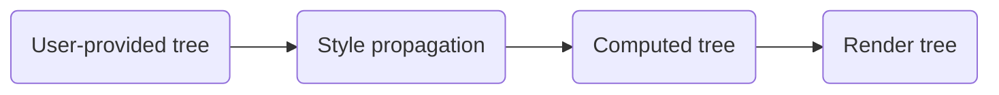

# Entity Component System (ECS) {#EcsArchitecture}

\tableofcontents

Donner uses a data-oriented Entity Component System (ECS) design pattern to store and manipulate the SVG document. This is a common pattern in game development, since it optimizes for performance via cache-friendly data structures and parallelism.

## Entities

Entities are the primary data structure in ECS. They are simply a unique identifier for a set of components. In Donner, entities are represented by a 32-bit unsigned integer, using a typedef for `entt::entity`.

```cpp
using Entity = entt::entity;
```

An entity is created by calling `registry.create()` without any components. Here is how the `Entity` is created for SVG elements.

```cpp
EntityHandle CreateEntity(SVGDocument& document, const XMLQualifiedNameRef& tagName, ElementType type) {
  Entity entity = document.registry().create();
  registry.emplace<components::TreeComponent>(entity, tagName);
  registry.emplace<components::ElementTypeComponent>(entity, type);
  registry.emplace<components::TransformComponent>(entity);
  return EntityHandle(registry, entity);
}
```

## Components

Components are the data associated with an entity, which are efficiently stored to allow for both fast lookup and iteration.

```cpp
// Get an entity's component by reference.
auto& transform = registry.get<components::TransformComponent>(entity);

// Iterate over all TransformComponents for all entities.
for (auto entity : registry.view<components::TransformComponent>()) {
  components::TransformComponent& transform = view.get(entity);
}
```

Each component may only have one instance per entity, and each entity has an independent list of components. For example, it's easy to add a component to an entity to tag them or add data.

```cpp
struct InvalidateRenderTree {};

// Add a tag component to an entity.
registry.emplace<InvalidateRenderTree>(entity);
```

For a real-world example, here is how the `ViewBoxComponent` is created for SVG elements.

```cpp
struct ViewBoxComponent {
  /// Stored viewBox, if any.
  std::optional<Boxd> viewBox;
};
```

The same system is used to implement the tree structure, where a \ref donner::svg::components::TreeComponent "TreeComponent" is added to each entity that contains `Entity` references to its parent and children.

## Systems

Systems are singletons within the `Registry`, and are used to hold global state and operate on the component-system. Donner calls these contexts, for example \ref donner::svg::components::SVGDocumentContext "SVGDocumentContext" and \ref donner::svg::components::RenderingContext "RenderingContext".

There are also systems that are stateless, such as \ref donner::svg::components::LayoutSystem "LayoutSystem", which is instantiated on-demand to manipulate the ECS state.

For example:

```cpp
std::vector<std::string> outWarnings;
LayoutSystem().instantiateAllComputedComponents(registry, &outWarnings);
```

A list of systems can be found at \ref ecs_systems.

# Donner ECS Architecture

In Donner, each Entity corresponds to a single SVGElement.


Donner groups its components into categories, based on transformations that occur as the document is parsed and rendered.

## Component transformations

The rendering pipeline performs a series of operations:



Each operation saves its state through a set of components. For example, during **Style propagation** in \ref donner::svg::components::StyleSystem::computeAllStyles "StyleSystem::computeAllStyles", these transformations occur:

| User component                                                              | Styled component                                                                            |
| --------------------------------------------------------------------------- | ------------------------------------------------------------------------------------------- |
| \ref donner::svg::components::StyleComponent "StyleComponent"               | \ref donner::svg::components::ComputedStyleComponent "ComputedStyleComponent"               |
| \ref donner::svg::components::SizedElementComponent "SizedElementComponent" | \ref donner::svg::components::ComputedSizedElementComponent "ComputedSizedElementComponent" |

While StyleComponent stores user-provided style information, it does not apply the inherited properties or the CSS stylesheet. ComputedStyleComponent stores the final style information after applying all the rules.

This continues for the **Computed tree** and **Render tree**.

\ref donner::svg::components::PathComponent "PathComponent" and shape-specific components such as \ref donner::svg::components::RectComponent "RectComponent" store the user-provided shape information. These are transformed at the **Computed tree** stage into \ref donner::svg::components::ComputedPathComponent "ComputedPathComponent", which contains the \ref donner::svg::PathSpline "PathSpline" for the shape.

This step must happen _after_ the styling phase to ensure SVG2 presentation attributes are properly propagated.

For example, shape properties can be specified entirely in CSS:

```xml
<style>
circle {
  x: 100px;
  y: 0;
  r: 100px;
}
</style>

<circle fill="red" />
```

\htmlonly
<svg width="200" height="100" viewbox="0 0 200 100">

<style>
  circle {
    cx: 100px;
    cy: 0;
    r: 100px;
  }
  </style>
<circle fill="red" />
</svg>
\endhtmlonly

This is a new feature in SVG2 which strongly influences this pipeline.

The details above have been simplified, see \ref donner::svg::components::RenderingContext "RenderingContext" as the source of truth and full list of operations.

## Render tree instantiation

The final transformation occurs to instantiate the render tree, which occurs within \ref donner::svg::components::RenderingContext::instantiateRenderTree "RenderingContext::instantiateRenderTree".

This step traverses the tree and produces a sorted list of \ref donner::svg::components::RenderingInstanceComponent "RenderingInstanceComponent" corresponding to the draw order.

This list is then processed by \ref donner::svg::RendererSkia to produce the final output.

# API Layer

On top of the ECS model the user-facing API is implemented as a thin wrapper. For example, \ref donner::svg::SVGPathElement "SVGPathElement" proxies calls to the components layer with minimal logic:

```cpp
SVGPathElement SVGPathElement::Create(SVGDocument& document, EntityHandle handle) {
  EntityHandle handle = CreateEntity(document, Tag, Type);
  handle.emplace<components::RenderingBehaviorComponent>(
      components::RenderingBehavior::NoTraverseChildren);
  return SVGPathElement(handle);
}

RcString SVGPathElement::d() const {
  if (const auto* path = handle_.try_get<components::PathComponent>()) {
    if (auto maybeD = path->d.get()) {
      return maybeD.value();
    }
  }

  return "";
}

void SVGPathElement::setD(RcString d) {
  invalidate();

  auto& path = handle_.get_or_emplace<components::PathComponent>();
  path.d.set(d, css::Specificity::Override());
}

std::optional<PathSpline> SVGPathElement::computedSpline() const {
  compute();
  if (const auto* computedPath = handle_.try_get<components::ComputedPathComponent>()) {
    return computedPath->spline;
  } else {
    return std::nullopt;
  }
}
```

This enables API objects to be zero-cost and stateless. The only object held within these objects is the `EntityHandle`, which is a lightweight wrapper around the `Entity` and `Registry` (~16 bytes with alignment).

<div class="section_buttons">

| Previous                         |                        Next |
| :------------------------------- | --------------------------: |
| [Coding style](CodingStyle.html) | [CSS](CssArchitecture.html) |

</div>
