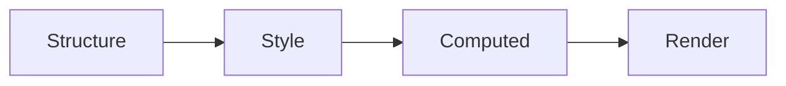

# Entity Component System (ECS) {#EcsArchitecture}

\tableofcontents

Donner uses a data-oriented Entity Component System (ECS) design pattern to store and manipulate the SVG document. This is a common pattern in game development, since it optimizes for performance via cache-friendly data structures and parallelism.

## Entities

Entities are the primary data structure in ECS. They are simply a unique identifier for a set of components. In Donner, entities are represented by a 32-bit unsigned integer, using a typedef for `entt::entity`.

```cpp
using Entity = entt::entity;
```

An entity is created by calling `registry.create()` without any components. Here is how the `Entity` is created for SVG elements.

```cpp
EntityHandle SVGElement::CreateEntity(Registry& registry, const XMLQualifiedNameRef& xmlTypeName,
                                      ElementType type) {
  Entity entity = registry.create();
  registry.emplace<components::TreeComponent>(entity, type, xmlTypeName);
  registry.emplace<components::TransformComponent>(entity);
  return EntityHandle(registry, entity);
}
```

## Components

Components are the data associated with an entity, which are efficiently stored to allow for both fast lookup and iteration.

```cpp
// Get an entity's component by reference.
auto& transform = registry.get<components::TransformComponent>(entity);

// Iterate over all TransformComponents for all entities.
for (auto entity : registry.view<components::TransformComponent>()) {
  components::TransformComponent& transform = view.get(entity);
}
```

Each component may only have one instance per entity, and each entity has an independent list of components. For example, it's easy to add a component to an entity to tag them or add data.

```cpp
struct InvalidateRenderTree {};

// Add a tag component to an entity.
registry.emplace<InvalidateRenderTree>(entity);
```

For a real-world example, here is how the `ViewboxComponent` is created for SVG elements.

```cpp
struct ViewboxComponent {
  /// Stored viewbox, if any.
  std::optional<Boxd> viewbox;

  /**
   * Computes the transform for the given Viewbox per
   * https://www.w3.org/TR/SVG2/coords.html#ComputingAViewportsTransform
   *
   * @param size The position and size of the element.
   * @param preserveAspectRatio The preserveAspectRatio property.
   */
  Transformd computeTransform(Boxd size, PreserveAspectRatio preserveAspectRatio) const;
};
```

The same system is used to implement the tree structure, where a `TreeComponent` is added to each entity that contains `Entity` references to its parent and children.

## Systems

Systems are singletons within the `Registry`, and are used to hold global state and operate on the component-system. Donner calls these contexts, for example `DocumentContext` and `RenderingContext`.

# Donner ECS Architecture

In Donner, each Entity corresponds to a single SVGElement.


Donner groups its components into categories, based on transformations that occur as the document is parsed and rendered.



TODO: Expand this out

- More details about the rendering pipeline
- Systems overview

<div class="section_buttons">

| Previous                         | Next |
| :------------------------------- | ---: |
| [Coding style](CodingStyle.html) |      |

</div>
