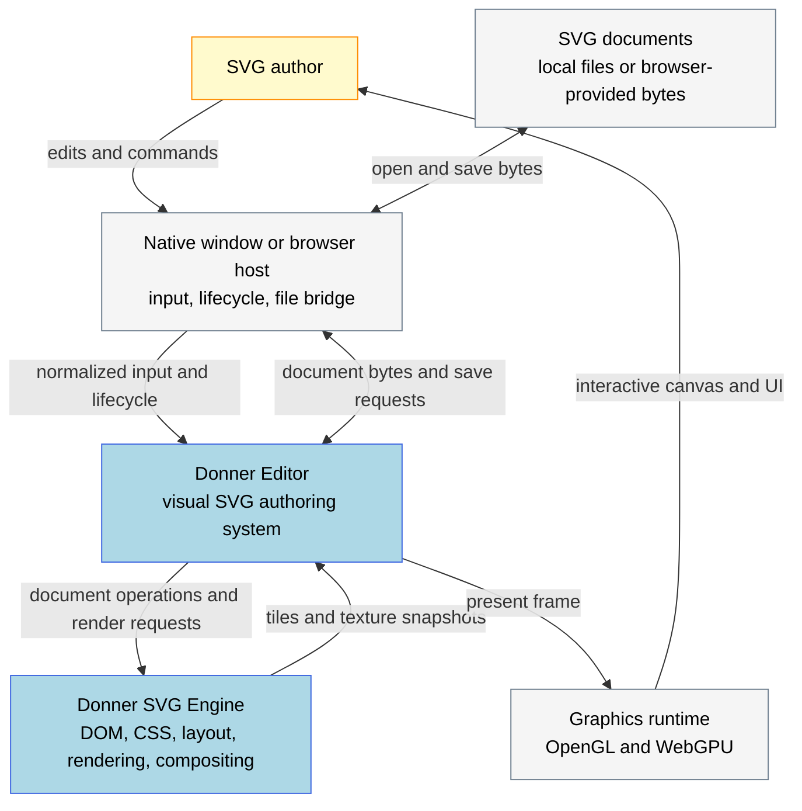
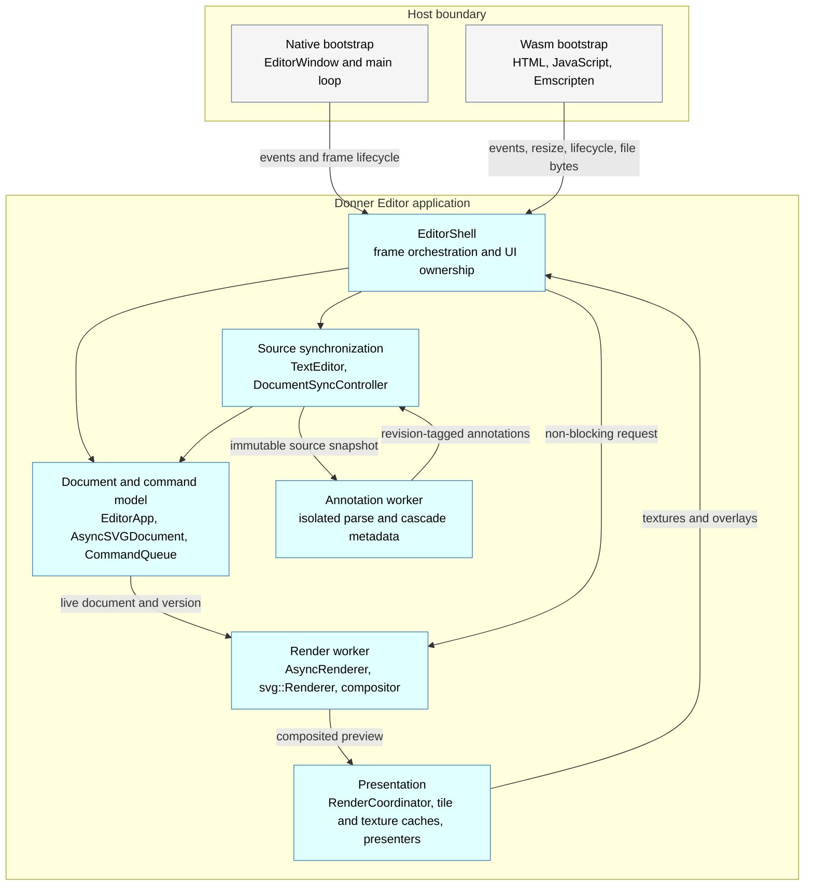
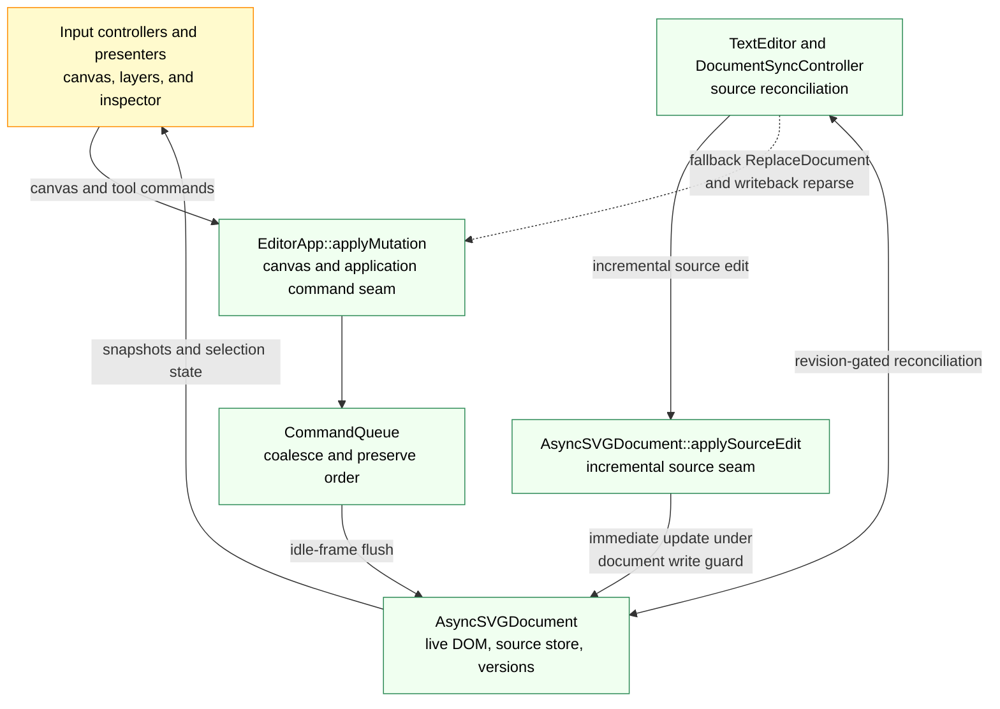
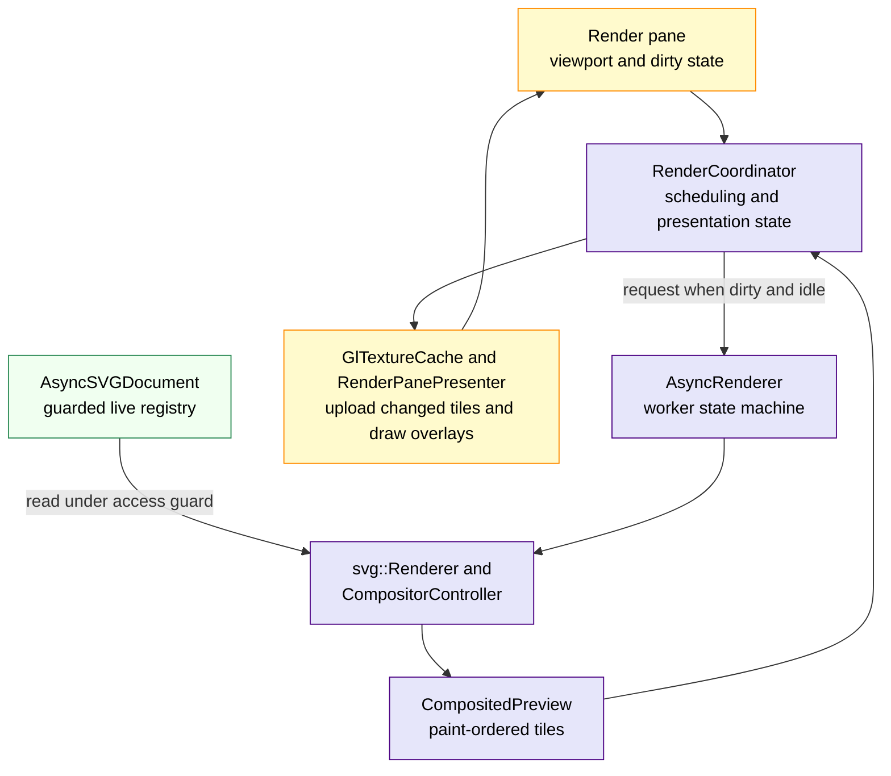
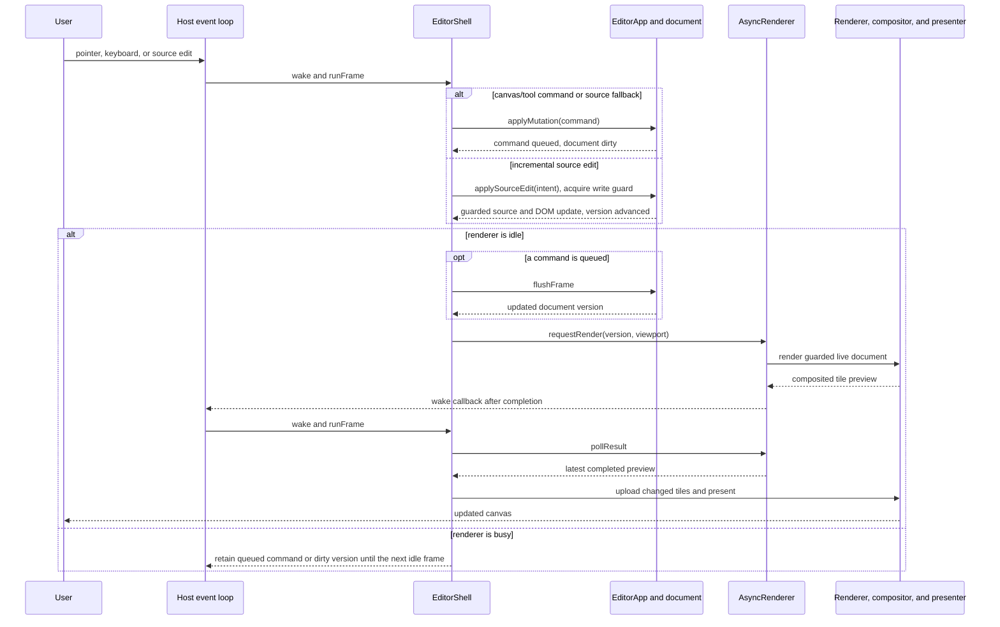

# Editor Architecture {#EditorArchitecture}

\tableofcontents

## Overview

`//donner/editor` is Donner's in-tree SVG editor. The native GLFW host and the
WebAssembly browser host share one Dear ImGui application that presents a document
as synchronized interactive canvas and XML source views. Native and Wasm release
targets use the Geode GPU backend and the basic text tier.

Two properties shape the whole design:

- **Rendering runs on a background worker thread.** Canvas, tool, and application commands queue
  without waiting for a render and apply when the worker is idle; finished renders are polled back
  as composited tiles. Incremental source-pane edits are the exception: they take the document's
  exclusive write guard immediately and can briefly block the UI thread until an in-flight render
  releases that guard.
- **The frame loop is event-driven, not free-running.** `main()` blocks in
  `waitEvents`/`waitEventsTimeout` until input arrives, the worker signals
  completion, or a timed UI task is due; only then does it produce a frame. No
  frames are drawn between those wake sources.

Guarantees callers can rely on:

- **Two guarded write seams.** Canvas, tool, and application commands enter through
  `EditorApp::applyMutation(EditorCommand)` and its command queue. Incremental source-pane edits
  enter through `AsyncSVGDocument::applySourceEdit()` so the XML source store and live SVG
  projection change together. Tools may configure detached elements while constructing a command,
  but never mutate an element already attached to the live document.
- **Edits cannot race the renderer.** Queued commands are flushed only while the async renderer
  reports `!isBusy()`. Structured source edits acquire the SVG document's concurrent-DOM write
  guard. A render in flight therefore either defers a queued flush or makes source dispatch wait
  until guarded access is available. That blocking source-edit handoff is a known contention point,
  not an asynchronous queue.
- **The interactive editor renders in-process.** The removed process-isolation
  prototype is no longer a layer the GUI editor can route through; v1.0 sandboxing
  is expected to be a replacement design.

## C4 Architecture Views

These views use the C4 progression from system context to containers and components. The
boundaries are logical ownership boundaries; most containers compile into one native or Wasm
application.

### Level 1: System context

An SVG author interacts with Donner Editor through either a desktop window or a browser tab. The
editor reads and writes SVG documents through its host, delegates SVG semantics and rendering to
the Donner engine, and presents pixels through the host graphics runtime.

The browser host serves static package bytes and passes browser capabilities into the Wasm
bootstrap. It is not a server-side editing service, and the editor does not require a network
service for document processing.

### Level 2: Application containers

The UI thread owns `EditorShell`, the command queue, and all ImGui state. The render worker owns
renderer and compositor execution. The annotation worker parses an immutable source copy and
cannot return live DOM handles.

### Level 3: Editor components and data flow

The component boundaries enforce two invariants: attached-DOM writes use one of the two guarded
seams above, and a command-queue mutation is not flushed while a render result is in flight or
waiting to be polled.

### Dynamic view: one edit-to-pixel cycle

Completion signals wake the event-driven host loop, so a result can be presented without a
free-running redraw loop. Cancellation replaces stale in-flight requests at compositor safe
points.

## Architecture Snapshot

### Boot and frame loop

- **`main()`** (`donner/editor/main.cc`) parses argv (a positional SVG path,
  `--save-repro <path>`), constructs `gui::EditorWindow` (GLFW + OpenGL/WebGPU +
  ImGui, `donner/editor/gui/EditorWindow.h`) and `EditorShell`, then runs the
  event-driven loop: `waitEvents(timeout)` → `window.beginFrame()` →
  `shell.runFrame()` → `window.endFrame()`. The timeout comes from
  `EditorShell::nextIdleWakeSeconds()` so throttled UI work still wakes the loop.
- **`EditorShell`** (`donner/editor/EditorShell.h`) is the stateful frontend that
  owns essentially all long-lived orchestration state: `EditorApp`, the tools,
  `TextEditor`, its purpose-specific `GlTextureCache` instances, `RenderCoordinator`,
  `DocumentSyncController`,
  the viewport/input controllers, and the presenters.
- **`EditorShell::runFrame()`** each frame: (1) poll the latest async render into
  GL textures via `RenderCoordinator::pollRenderResult`; (2) if `!isBusy()`, flush
  queued edits (`EditorApp::flushFrame`) and refresh selection bounds; (3) sync
  parse-error markers and apply pending canvas→source writebacks through
  `DocumentSyncController`; (4) compute the adaptive UI profile and pane layout,
  handle shortcuts, and render the desktop menu bar or compact command bar; (5)
  render the panes; (6) if `!isBusy()`, request the next render
  via `RenderCoordinator::maybeRequestRender`; (7) collect a `FrameCostBreakdown`
  and emit frame-miss/resource telemetry. Queued canvas-text characters are
  coalesced before the mutation flush, so one UI frame performs one text-content
  synchronization rather than one synchronization per queued codepoint.

The welcome catalog renders each bundled SVG once through a dedicated offscreen
`svg::Renderer` at thumbnail resolution. A dedicated texture cache uploads those owned bitmaps for
`SamplePickerPresenter`; ImGui only lays out cards and blits the resulting textures. Keeping this
cache separate from Layers previews prevents the live-row retention sweep from evicting samples.
Generation advances by at most one catalog entry per UI frame and explicitly wakes the event loop
until the bounded cache is complete.

### The document write seams

Attached live-DOM writes enter through two explicit, guarded paths:

- **Canvas, tool, and application commands** call `EditorApp::applyMutation(EditorCommand)`. The
  method pushes onto the document's command queue and marks the document dirty; nothing is applied
  immediately. Tools can build and configure detached elements as command payloads, but do not call
  mutation methods on attached live elements.
- **Incremental source-pane edits** flow from `DocumentSyncController` through the source-sync
  helpers to `AsyncSVGDocument::applySourceEdit()`. That path updates XML source bytes and the SVG
  semantic projection together under `SVGDocument`'s concurrent-DOM write guard, then advances the
  frame version. Because source dispatch is immediate rather than queued, it can block the UI thread
  while an in-flight render holds the document guard. If an edit cannot be handled incrementally,
  source sync falls back to a queued `ReplaceDocument` command through
  `EditorApp::applyMutation()`.

- **`AsyncSVGDocument`** (`donner/editor/AsyncSVGDocument.h`) wraps `svg::SVGDocument`, queues
  command-based writes in a UI-thread-only per-frame `CommandQueue`, and exposes the guarded
  incremental-source seam. `flushFrame()` drains and applies the queue once per frame and bumps a
  `frameVersion` counter; full document replacements bump a separate `documentGeneration`. Both are
  atomics the render worker can poll. `applySourceEdit()` routes incremental XML-source edits
  through `donner/base/xml` for structured editing.
- **`CommandQueue`** (`donner/editor/CommandQueue.h`) is UI-thread-only and
  coalesces on flush: `ReplaceDocument` is exclusive and drops earlier commands;
  repeated `SetTransform` on the same entity collapse to the latest (a 60 fps drag
  flushes as a single `setTransform`); structural `Insert`/`Delete` never coalesce;
  commands are never reordered across entities.
- **`setDocumentMaybeStructural`** builds an entity remap against the current
  document; when the new tree matches by tag + id, the replacement is tagged
  `Structural` and the remap rides the next render request so the compositor
  preserves cached layer bitmaps instead of resetting them.
- **Undo/redo** goes through `UndoTimeline`; restored transforms are re-applied as
  commands. Canvas→source writebacks (transform, element removal) are queued on
  `EditorApp` and drained each frame by `DocumentSyncController`.

### Async rendering and threading

- **`AsyncRenderer`** (`donner/editor/AsyncRenderer.h`) owns a dedicated worker
  thread that owns the `svg::Renderer` and a `CompositorController` for its
  lifetime. Its state is a variant over `Idle`/`Rendering`/`Cancelling`/`Done`/
  `Shutdown`. `isBusy()` is true while a render is in flight _or_ a finished result
  awaits polling; the UI thread must not mutate the document or touch the renderer
  while it is true. `requestRender()` is non-blocking and cancels+replaces an
  in-flight request; cancellation is delivered through a
  `svg::compositor::CancellationToken` polled at compositor safe points.
- **Threading model.** The worker shares the _live_ registry rather than deep-copying
  (`SVGDocument` is a value facade over a `shared_ptr<Registry>`). On first render
  the document is flipped to `svg::ThreadingMode::ConcurrentDom` for the editor's
  lifetime; the worker takes a `DocumentWriteAccess` guard across the render and
  releases it before touching its own mutex to avoid lock-order inversion.
  UI-thread DOM reads take their own read-access guard. This is the editor-side
  application of the DOM lifetime ownership model (see \ref Multithreading).
- **Source-edit contention.** The source-pane structured-edit path requests a blocking
  `DocumentWriteAccess` from the UI thread even when the renderer is busy. This is race-safe, but a
  long render can delay source typing until the worker releases its guard. Moving this path onto an
  idle-frame queue is a future responsiveness improvement, not a current invariant.
- **`RenderCoordinator`** (`donner/editor/RenderCoordinator.h`) owns the
  renderer-side orchestration: the `RenderWorkerBundle` (renderer + `AsyncRenderer`,
  destroyed in reverse order so the worker joins before the renderer it references),
  the composited presentation, the selection-bounds cache, and render scheduling
  with pinch-zoom / canvas-size / raster-viewport debouncing.

### Compositor and presentation

A render produces a `RenderResult` whose `CompositedPreview` is a paint-order list
of `CompositedTile`s. Each tile carries either a CPU `RendererBitmap` or a backend
`RendererTextureSnapshot`, plus document-unit geometry and a drag translation so
tiles slide in real time without re-rasterizing. `GlTextureCache` uploads one GL
texture per tile keyed on a stable tile id, reusing textures across frames while
the tile `generation` is unchanged (and supporting metadata-only tiles).
`RenderPanePresenter` blits the cached tiles into the ImGui draw list; editor chrome
(selection outlines, marquee, handles) is drawn by `OverlayRenderer` or as an
immediate ImGui overlay. `svg::Renderer` is backend-agnostic and resolves at build
time to tiny-skia (software) or Geode (GPU, `DONNER_EDITOR_WGPU`); the shipped
`editor` target uses Geode.

During an active transform, `SelectTool` exposes gesture-owned bounds and transform
state. `OverlayRenderer` builds combined bounds and handles directly from that
snapshot instead of traversing selected geometry every pointer frame. A presented
tile carrying a live entity matches an active drag only when the entity identities
are equal; the boolean drag-target marker is used only for entity-less legacy tiles.

The composited-tile presentation is the subject of its own design work; this doc
describes the editor's consumption of it.

### Panes, tools, and presenters

- **Panes** are immediate-mode borderless ImGui windows; layout math lives in
  `EditorShellLayout`. The **render pane** (`RenderPanePresenter`) blits tiles and
  overlay chrome and owns pointer capture; the **source pane** is `TextEditor`
  (headless core split into `TextEditorCore`); **Layers** (`LayersPanel`) renders
  the user-facing document tree; **Inspector** (`SidebarPresenter`) renders XML,
  CSS, and transform state from a snapshot refreshed only while the worker is
  idle; `LayerInspectorPanel` is the separate compositor diagnostics view; the
  **menu bar** (`MenuBarPresenter`) returns a semantic `MenuBarActions` struct the
  shell acts on; **dialogs** (Open/Save/About/Licenses) are `DialogPresenter`.
- **Tools** implement the `Tool` interface (`onMouseDown`/`onMouseMove`/`onMouseUp` in
  document-space coordinates). They submit attached-document changes through
  `EditorApp::applyMutation`; a tool may configure a detached element before placing it in an
  `InsertElement` command, but never mutates an attached live element directly. `SelectTool`
  handles select / marquee / move / resize / rotate (emitting `SetTransform` commands); `PenTool`
  is a prototype path-authoring tool. Input is dispatched inside the render pane, mapping ImGui
  mouse state through `ViewportInteractionController::screenToDocument` to the active tool.
- **Source ↔ canvas sync** is handled by `DocumentSyncController` and documented in
  \ref StructuredSourceEditing.
- **Source style annotations** are computed from an immutable source copy on a
  separate worker. The worker owns an isolated parsed document and returns cascade
  metadata plus deduplicated `AttributeWritebackTarget` locators, never live
  `SVGElement` handles. `EditorShell` applies a result only when both document
  generation and source version still match, then resolves all locators in one
  read-guarded document traversal.
- **Source reveal layout** preserves the document point under the render-pane center.
  `ViewportState` selects a pane-bounded raster only when its pixel area is smaller
  than the full-document raster, unless a backend dimension cap requires bounds.

### Adaptive UI profile

`ComputeEditorAdaptiveUiLayout` in `EditorShellLayout` is the pure policy boundary
between desktop and `CompactTouch` chrome. It receives logical window dimensions
and a platform touch preference, then returns top-bar, tool-size, sheet-placement,
and feature-subset decisions. Native constrained windows use the compact profile;
the WebAssembly shell prefers it when the browser reports touch points or a coarse pointer.

Compact mode gives the render pane the full DockSpace and presents one Layers or
Inspector sheet over it. Portrait uses a bottom sheet; landscape uses a right
sheet clamped to a useful reading width. Desktop and compact layouts have distinct
DockSpace ids. The shell rebinds only the Render window when switching profiles,
leaving the desktop dock tree, source visibility, and sidebar width intact.

Touch adaptation is deliberately above the document and renderer layers. Compact
commands call the same `EditorApp`, tool, and presenter seams as desktop commands.
The shell increases hit tolerance without increasing selection-handle artwork and
uses 44 logical pixel command, row, and field targets. The Wasm bootstrap translates
one captured touch pointer into the ordinary ImGui mouse stream for taps and direct
drags. Browser code remains responsible for resize, virtual-keyboard, lifecycle, and
future multi-touch gesture integration.

## Code-level landmarks

| Responsibility           | Primary code                                                              | Focused verification                                                                              |
| :----------------------- | :------------------------------------------------------------------------ | :------------------------------------------------------------------------------------------------ |
| Host and frame lifecycle | `donner/editor/main.cc`, `gui/EditorWindow.h`, `wasm/editor-bootstrap.js` | `EditorShellLayout_tests.cc`, browser smoke and lifecycle tests                                   |
| UI orchestration         | `EditorShell.h`, `EditorShell.cc`                                         | `EditorDockLayout_tests.cc`, presenter and frame-budget tests                                     |
| Document write seams     | `EditorApp.h`, `CommandQueue.h`, `AsyncSVGDocument.h`, `SourceSync.h`     | `EditorApp_tests.cc`, `CommandQueue_tests.cc`, `AsyncSVGDocument_tests.cc`, `EditorSync_tests.cc` |
| Source synchronization   | `DocumentSyncController.h`, `TextEditorCore.h`                            | `DocumentSyncController_tests.cc`, `EditorSync_tests.cc`                                          |
| Background annotations   | `StyleSourceAnnotations.h`                                                | `StyleSourceAnnotations_tests.cc`                                                                 |
| Render scheduling        | `RenderCoordinator.h`, `AsyncRenderer.h`                                  | `RenderCoordinator_tests.cc`, `AsyncRenderer_tests.cc`                                            |
| Composited presentation  | `CompositedPresentation.h`, `GlTextureCache.h`, `RenderPanePresenter.h`   | `CompositedPresentation_tests.cc`, `GlTextureCache_tests.cc`, browser compositing tests           |
| Interaction tools        | `Tool.h`, `SelectTool.h`, `PenTool.h`                                     | tool, gesture, click, and drag-coalescing tests                                                   |

## API Surface

The editor is an application, not a reusable library API, but the load-bearing
entry points are:

- `EditorApp::applyMutation(EditorCommand)` - queued canvas, tool, and application commands.
- `AsyncSVGDocument::applySourceEdit(XMLEditIntent)` - guarded incremental source-pane edits.
- `EditorApp::loadFromString(std::string_view)` / `AsyncSVGDocument::flushFrame()`
  / `currentFrameVersion()` — document lifecycle used by the frame loop.
- `EditorShell::runFrame()` / `nextIdleWakeSeconds()` — the per-frame tick.
- `ComputeEditorAdaptiveUiLayout()` - pure desktop/compact profile selection and
  sheet geometry.
- `AsyncRenderer::requestRender()` / `pollResult()` / `isBusy()` — the render
  handoff; plus the replay-only test hooks documented in
  \ref DeterministicReplayTesting.

## Security and Safety {#EditorArchSecurity}

- **In-process rendering.** The interactive editor parses and renders untrusted SVG
  in-process on the worker thread. The former process-isolation prototype has
  been removed, so there are no standalone sandbox parser/renderer binaries. A
  production replacement sandbox remains in the v1.0 scope.
- **Save-path invariants** (`donner/editor/DocumentSave.h`): existing destinations
  are opened `O_NOFOLLOW` (no symlink following), missing ones created
  `O_CREAT | O_EXCL`, with no pre-`stat` (avoiding a TOCTOU window). Save writes the
  XML source-store bytes verbatim and only after `hasSourceStore()` passes.
- **Concurrent DOM access** is guarded: the worker holds `DocumentWriteAccess` for
  the render; UI-thread reads take a read-access guard. Illegal cross-thread access
  is designed to fail deterministically in debug builds.
- **Source annotation isolation** is revision-gated. Background parsing uses a
  separate registry; registry-backed element handles are cleared before the result
  crosses threads, and stale document/source revisions are discarded.
- **Dynamic strings** are rendered with `ImGui::TextUnformatted(...)` rather than as
  format strings; this is an enforced-by-convention practice in the editor code, not
  a separate lint rule.
- **Adaptive chrome adds no authority.** Compact commands reuse existing mutation,
  file-dialog, and render seams. The profile itself performs no network, storage,
  clipboard, or document access.
- **`stb_image`** is not used anywhere under `donner/editor/`; image decoding runs
  behind `svg::Renderer` on the worker.
- **Profiling.** Tracy instrumentation compiles to no-ops unless `ENABLE_TRACY` is
  defined (native builds enable it; RE/WASM builds do not).

## Testing and Observability

Tests live under `donner/editor/tests/`. By area:

- **Orchestration / document:** `EditorApp_tests.cc`, `EditorSync_tests.cc`,
  `CommandQueue_tests.cc`, `AsyncSVGDocument_tests.cc`,
  `DocumentSyncController_tests.cc`, `UndoTimeline_tests.cc`.
- **Async rendering / compositor:** `AsyncRenderer_tests.cc`,
  `RenderCoordinator_tests.cc`, `CompositedPresentation_tests.cc`,
  `GlTextureCache_tests.cc`, `EditorLayerStress_tests.cc`, and the
  `AsyncRendererFilterGroup*` / `FilterDragRepro*` correctness and perf suites.
- **Tools / interaction:** `SelectTool_tests.cc`, `PenTool_tests.cc`,
  `RenderPaneClick_tests.cc`, `RenderPaneGesture_tests.cc`, `DragCoalesce_tests.cc`,
  `ViewportInteractionController_tests.cc`.
- **Presenters / UI:** `SidebarPresenter_tests.cc`, `RenderPanePresenter_tests.cc`,
  `OverlayRenderer_tests.cc`, `LayerInspectorDiagnostics_tests.cc`,
  `EditorShellLayout_tests.cc`, `EditorDockLayout_tests.cc`, and
  `LayersPanel_tests.cc`.
- **Persistence / replay:** `DocumentSave_tests.cc`, `RnrReplay_tests.cc`,
  `GlRnrReplay_tests.cc` (see \ref DeterministicReplayTesting).
- **Fuzz / telemetry:** `EditorStateMachine_fuzzer.cc`,
  `FrameMissTelemetry_tests.cc`.

Per-frame `FrameCostBreakdown` and layer-inspector freshness diagnostics are
surfaced for both the live layers panel and the replay/readback harnesses.

## Limitations and Future Extensions

- The GUI editor renders untrusted input in-process until the v1.0 sandbox redesign
  lands.
- `PenTool` is a prototype path-authoring tool; richer path editing and boolean
  operations are tracked in their own design docs.
- Compact touch mode intentionally omits source editing, paint controls, the
  contextual text format bar, canvas scrollbars, and compositor diagnostics. It
  is a canvas-first editing subset, not a compressed copy of every desktop panel.
- The editor is an application binary, not a stable embedding API; the entry points
  above are internal contracts, not a supported external interface.
