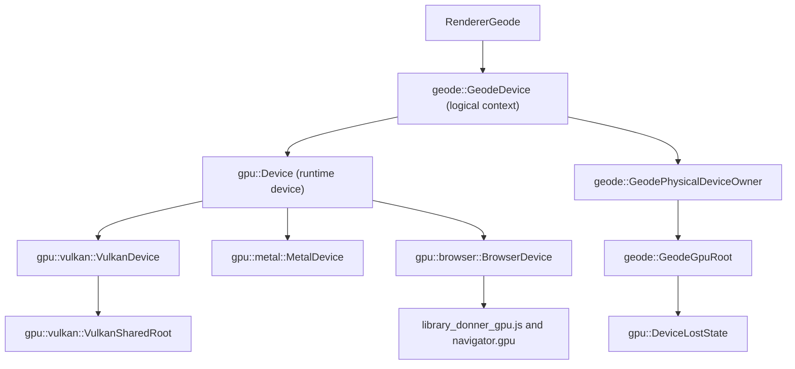

# GPU Runtime Reference {#GpuRuntime}

\tableofcontents

This reference is for Donner developers working on Geode, the editor, or the GPU runtime under
`donner/gpu/`. It states who owns each GPU object, how a backend is chosen on each platform, and
what the runtime does when the GPU fails. The [native embedding guide](guides/embedding_geode.md)
walks through the same contracts from a windowed host, and
[design 0053](design_docs/0053-native_gpu_hal.md) records how the runtime got here.

The runtime is internal to Donner. For v0.8 the maintainer decided that there is no native
embedding surface beyond internal callers: the editor, the in-tree
\ref geode_embed.cc "embed example" and Donner's own tests. Bazel visibility confines the
runtime and Geode device targets to Donner's packages and `//examples`. Applications render
through the public \ref donner::svg::Renderer API.

`//donner/svg/renderer:renderer_geode` itself is public, and `RendererGeode.h` declares the
shared-context constructor `RendererGeode(std::shared_ptr<geode::GeodeDevice>)` and
`setTargetTexture(const gpu::Texture&)`. The targets that define the types they take are
visible only inside the repository: `//donner/svg/renderer/geode:geode_device_api`, which owns
`GeodeDevice.h`, `//donner/svg/renderer/geode:geode_device`, and the `//donner/gpu` package's
libraries. That visibility keeps a target outside Donner from depending on them. Donner's
`.bazelrc` disables `layering_check`, so visibility does not stop a dependent of `renderer_geode`
from reaching their headers; the seam is internal because of the v0.8 decision together with that
visibility rule.

## Layers {#GpuRuntimeLayers}

| Layer           | Type                                           | Responsibility                                                                                                                                      |
| --------------- | ---------------------------------------------- | --------------------------------------------------------------------------------------------------------------------------------------------------- |
| Renderer        | `svg::RendererGeode`                           | Translates `RendererInterface` draws into Geode encoders on one logical context.                                                                    |
| Logical context | `geode::GeodeDevice`                           | Pipelines, filter engine, caches, counters, deferred retirement and snapshot readback for one rendering client. Renders through one runtime device. |
| Physical owner  | `geode::GeodePhysicalDeviceOwner`              | Shared by every context over one root. Keeps the root and the first context's runtime device alive.                                                 |
| Backend root    | `geode::GeodeGpuRoot`                          | The selected backend, its capabilities and the loss condition its devices share. On Vulkan it also retains the `VulkanSharedRoot`.                  |
| Runtime device  | `gpu::Device`                                  | Validated resource creation, queue writes, submission, mapping, surfaces and cross-device texture registration. One per context.                    |
| Backend         | `MetalDevice`, `VulkanDevice`, `BrowserDevice` | Translate validated operations into the platform API through the protected `on*` hooks of `gpu::Device`.                                            |

## Ownership {#GpuRuntimeOwnership}

### Roots, contexts and runtime devices {#GpuRuntimeContexts}

- A root is selected once (see [Backend selection](#GpuRuntimeBackendSelection)) and shared.
  `GeodeDevice::CreateOverSelectedRoot()` builds the physical owner and the first context, which
  renders through the root's first runtime device. `GeodeDevice::CreateHeadless()` selects a root
  with default options and then does the same.
- `GeodeDevice::CreateOverPhysicalDeviceOwner()` builds a sibling context over the same root. It
  gets a runtime device of its own, with separate handle tables, submission serials, counters,
  pipelines and retirement, and shares the root's loss condition. It refuses a null or lost owner.
  The editor's UI framebuffer is such a second context; the native editor renders documents
  through the first. In the browser editor, the raster worker renders documents through a browser
  device of its own, because a browser device belongs to the worker that obtained it.
- The physical owner declares the root before the runtime device it holds, so the root outlives
  every device built over it. The root is released once, after the last context lets go.
- `GeodeDevice` is neither copyable nor movable; callers hold it by `std::unique_ptr` or
  `std::shared_ptr`.
- `RendererGeode(verbose)` leases an idle headless context from a process-wide cache that keeps
  up to four (`svg::details::HeadlessDevicePool`); the context goes back to the cache when the
  renderer releases it, and a lost context is never handed out again.
  `RendererGeode(std::shared_ptr<geode::GeodeDevice>)` shares the caller's context, which must
  outlive every frame rendered through it.
- A `gpu::Device` and everything created from it are used from one thread at a time. A browser
  device is also pinned to the worker that obtained it (`GeodeDevice::isBoundToCreatingThread()`),
  and the headless cache hands such a device back only to that thread.
- State a document keeps for a context can be destroyed on another thread. Its buffers and bind
  groups go to the context's `GeodeHandleRetirement`, which releases them on the context's own
  thread.

### Resource handles {#GpuRuntimeHandles}

- `gpu::Buffer`, `gpu::Texture` and the other handles in `donner/gpu/Handles.h` are move-only
  RAII values that carry their device's identity and a slot generation. Every use is validated in
  release builds: a null or stale handle fails with `GpuErrorType::InvalidHandle`, and another
  device's handle with `GpuErrorType::DeviceMismatch`.
- Dropping a handle, or calling a `destroy*` method, makes it stale at once. The backend object
  stays alive until every submission that referenced it has completed (`completedSerial()`);
  `poll()`, `submit()` and the `destroy*` methods reclaim it. `PipelineLayout` and `ShaderModule`
  are released immediately because recorded commands never name them.
- `destroyBufferBacking()` and `destroyTextureBacking()` release an allocation at once, for a
  caller that knows no unfinished submission reads it: a cancelled map, an evicted pool entry or a
  replaced render target.
- A handle that outlives its device releases nothing; device teardown already freed the resource.
- A `gpu::DeviceObserver` hears every accepted allocation, write, submission and texture release on
  every backend. Each `GeodeDevice` installs one on its runtime device to feed `GeodeCounters`.

### Textures {#GpuRuntimeTextures}

A runtime device names a texture in one of three roles:

| Role           | Created by                        | Owner of the allocation                            | Ends                                                                                                      |
| -------------- | --------------------------------- | -------------------------------------------------- | --------------------------------------------------------------------------------------------------------- |
| Owned texture  | `Device::createTexture()`         | The device that created it                         | The handle is destroyed; the allocation goes once its last submission completes and no export holds it    |
| Registration   | `Device::registerTexture()`       | The producer; the consumer holds a read-only alias | The consumer releases it; its hold on the allocation drops after the consumer's last submission naming it |
| Acquired frame | `Device::acquireCurrentTexture()` | The surface                                        | `presentSurface()`, `abandonCurrentTexture()` or a reconfiguration invalidates it                         |

`Device::ownsTextureBacking()` is true only for an owned texture, so a caller can never free
memory a surface or another device still owns.

A host render target is a `RendererGeode` role over one of these, not a fourth kind of texture:
`RendererGeode::setTargetTexture()` takes an owned texture or an acquired frame of the renderer's
own device and keeps only its identity, for every frame until `clearTargetTexture()`. The caller
keeps the texture live from `beginFrame()` through `endFrame()`.

Cross-device registration has a producer half and a consumer half.
`Device::exportTexture()` runs on the producer's thread and returns a `gpu::TextureExport`: an
immutable, thread-safe token that holds the allocation. `Device::registerTexture()` runs on the
consumer's thread, reads only the token, and limits the registration's usage to `Sampled` and
`CopySrc`. Work the consumer submits is ordered after the producer work the registration covers:
by the shared queue on Vulkan and in the browser, and by a GPU-side wait on the producer's shared
event on Metal, where each runtime device has its own command queue. An acquired surface frame
cannot be exported on Metal or Vulkan, because the surface can recycle it at presentation. Bytes
of released textures that a token or registration still holds are reported by
`Device::sharedTextureTailBytes()`. Geode's consumers register through
`geode::RegisterOrderedTexture()`. The full contract is in
[Cross-device texture registration](design_docs/0053-native_gpu_hal.md#cross-device-texture-registration).

### Snapshots {#GpuRuntimeSnapshots}

- `RendererGeodeTextureSnapshot::AdoptRuntimeTexture()` takes over a texture the runtime
  allocated and keeps it, and its `GeodeDevice`, alive after the renderer moves on. It refuses a
  registration, which owns no backing. The export a consumer registers is taken on the producer's
  thread at adoption (`textureExport()`), so registering it never touches the producing device.
- A snapshot of the renderer's current frame can borrow its target instead of owning it; the
  renderer destroys that view before it replaces, detaches or releases the target.
- `dimensions()` is the valid content extent. `allocationDimensions()` can be larger, because an
  uploader that keeps an oversized allocation across payloads re-points the snapshot with
  `setDimensions()`.
- `takeSnapshot()` and `takeSnapshotInterruptibly()` read pixels back to the CPU on a separate
  readback context over the same root, so a capture never touches the producer's handle tables or
  serials. A capture has a total budget of 10 seconds (`geode::kReadbackMapTimeout`) and can be
  cancelled. A borrowed surface frame reads back as an empty bitmap because its export is refused.

Explicit captures are CPU consumers by design. Ordinary native composition and presentation keep
pixels on the GPU. The browser editor currently moves document pixels from its raster worker to
its UI thread as CPU bitmaps, because direct texture handles do not cross workers; design 0053
tracks that handoff as an open transport defect, not as the intended data path.

### Uploads and mappings {#GpuRuntimeUploads}

- Queue writes (`Device::writeBuffer()`, `Device::writeTexture()`) never change bytes an already
  submitted command still reads. What happens to a write into a resource that an earlier
  submission still uses depends on the write and the backend:
  - A buffer write whose offset and size are multiples of four bytes is queued in bounded host
    storage, on Metal and Vulkan, and copied at the start of the next submission. Metal also
    queues writes to a busy texture this way. Metal's queued and in-flight writes share a staging
    budget that defaults to `gpu::kMaxBufferByteSize` (1 GiB); on Vulkan the same 1 GiB budget
    covers queued buffer writes. Both backends accept at most 16,384 pending writes, and a write
    past either limit fails with `GpuErrorType::LimitExceeded` without being queued.
  - An unaligned write to a busy buffer waits for the buffer's last submission until the queue has
    made no progress for five seconds. If the wait gives up, the write fails without changing the
    buffer: with `GpuErrorType::InvalidState`, or on Vulkan with `GpuErrorType::DeviceLost` when
    another device over the root declared the loss.
  - Vulkan's `writeTexture()` always stages the texels in a transient buffer and submits a fenced
    upload that it waits for before returning. The wait gives up after 60 seconds without queue
    progress (`kUploadStallTimeout` in `VulkanDevice.cc`) with `GpuErrorType::InvalidState`. A
    root declared lost before or during the upload fails it with `GpuErrorType::DeviceLost`,
    unless the device has already recorded an error of its own.
- `Device::mapBufferAsync()` returns a `gpu::BufferMapping`. A buffer carries one mapping at a time,
  and a mapping is not ownership: destroying the buffer invalidates it. `mappedBytes()` is readable
  only after `waitForMapping()` or `pollMapping()` reports it ready, and only until
  `unmapBuffer()`. A submission that names a mapped buffer is refused.
- In the editor, `GlTextureCache` uploads CPU bitmap tiles into runtime textures through a bounded
  upload path, registers GPU snapshots with the `UiTextureRegistry`, and retires superseded
  payloads by presentation frame (`GlTextureCacheTest.RetiredSnapshotsAgeByPresentationFrame`). UI
  draw data names textures by `UiTextureId`, a slot plus generation, so a stale or recycled
  registration is refused before any GPU work is recorded.

### Surfaces {#GpuRuntimeSurfaces}

- `Device::createSurface()` makes a runtime surface on one runtime device from a
  `gpu::NativeSurfaceHandle`. The platform object stays the host's: a `CAMetalLayer`
  (`NativeSurfaceKind::MetalLayer`), a `VkSurfaceKHR` the host created against the root's instance
  (`NativeSurfaceKind::EmbedderSurface`), or a canvas (`NativeSurfaceKind::CanvasSelector`). In a
  worker a canvas selector names the canvas by element id; Donner passes `"#canvas"`.
- A surface presents only after `configureSurface()`. A resize reconfigures it, and a
  reconfiguration abandons any acquired frame.
- On Vulkan, `destroySurface()` is not proof that the swapchain is gone. The host keeps its
  `VkSurfaceKHR` and window until `VulkanSharedRoot::destroyExternalSurface()` succeeds with the
  registration `registerExternalSurface()` returned. If teardown cannot be proved, the surface,
  window and root are retained until process exit and every later Vulkan device creation fails;
  restart the process to use Vulkan again. See the
  [Linux Vulkan external-surface retirement gate](design_docs/0053-native_gpu_hal.md#linux-vulkan-external-surface-retirement-gate).

### Retirement order {#GpuRuntimeRetirement}

Tear down in the reverse order of construction:

1. Stop recording and submitting work. Present or abandon any acquired surface frame.
2. Destroy the renderers, snapshots and registrations that name a context's textures. A snapshot
   holds its `GeodeDevice`, so a context outlives its last snapshot.
3. Destroy runtime surfaces with `Device::destroySurface()`.
4. Release the logical contexts. Each `GeodeDevice` destructor waits for its own last submission,
   bounded by lack of progress, and releases its pipelines and caches before its runtime device and
   root. The physical owner, holding the root and the first context's runtime device, goes with the
   last context. In WebAssembly builds the destructor does not wait; the browser device goes with
   the last runtime device over it.
5. Release the host's platform objects. On Linux the host keeps its own `VulkanSharedRoot`
   reference through step 4, so the native root outlives the contexts, and calls
   `VulkanSharedRoot::destroyExternalSurface()` before destroying the window, as the embed
   example's `RetireNativeEmbedSurface()` does. On macOS the Metal layer belongs to its view.

Teardown on a lost root depends on the backend:

- `GeodeDevice::waitForQueueIdle()` returns at once, and so does the Metal backend's teardown
  drain. Metal retains every resource a committed command buffer references until that command
  buffer completes, so the device releases its own references without waiting.
- Vulkan teardown frees nothing native until a fence proves the work that used it complete. Only
  a signalled fence, or the driver's `VK_ERROR_DEVICE_LOST`, counts as proof, and the wait does not
  end because the root was declared lost. Each outstanding fence gets up to five seconds without
  queue progress (`kTeardownStallTimeout`), counted from the queue's last progress, or a fixed
  five seconds after a submission whose completion is unknown. The swapchain proves its own
  submissions the same way.
- When Vulkan cannot prove completion, as after a hang the driver never reported, the device's
  whole native graph is retained until process exit. The backend logs
  `[donner::gpu::vulkan] shutdown incomplete; Vulkan disabled until restart`, and every later
  Vulkan root or device creation fails until the process restarts.

## Backends {#GpuRuntimeBackends}

| Backend       | Runtime device                | Platform    | Shader projection | Devices over one root share                                           | Reports progress |
| ------------- | ----------------------------- | ----------- | ----------------- | --------------------------------------------------------------------- | ---------------- |
| Native Metal  | `gpu::metal::MetalDevice`     | macOS       | MSL               | The system default `MTLDevice`; each device has its own command queue | Yes              |
| Native Vulkan | `gpu::vulkan::VulkanDevice`   | Linux       | SPIR-V            | One instance, logical device and graphics queue (`VulkanSharedRoot`)  | Yes              |
| Browser       | `gpu::browser::BrowserDevice` | WebAssembly | WGSL              | The worker's one `GPUDevice` and its queue                            | No               |

Each product links only the shader projection its devices consume; see
[WGSL shader compilation](wgsl_compiler.md).

- **Metal.** Limits come from the device (`MetalDevice::QuerySystemCapabilities()`). Presentation
  uses a `CAMetalLayer` the host owns; a present waits for its frame's own work before it hands
  over the drawable, so the window never shows a frame the GPU is still drawing. At most 512
  command buffers are in flight per device (`MetalDevice::kMaxCommandBuffersInFlight`). Every call
  drains the Objective-C objects it autoreleased, so a worker thread needs no autorelease pool.
- **Vulkan.** Vulkan 1.1 core with classic render passes and per-submission fences; presentation
  also needs the swapchain-maintenance extension. A root lock spans barrier recording through
  queue submission, so devices over one root never encode from a stale image layout. Each buffer
  gets its own `VkDeviceMemory` allocation behind the `BufferSuballocator` seam in
  `VulkanBufferAllocator.h`. The code ties any future suballocating implementation to the driver's
  limit on how many allocations may exist at once, and leaves it until measurement shows that limit
  is the binding constraint. The maintainer decided that suballocation is not needed: on a
  discrete GPU, physical residency equals the logical allocation accounting plus one frame of
  transient textures.
- **Browser.** `donner/gpu/browser` expresses validated operations to `navigator.gpu` through
  `library_donner_gpu.js`. Browser objects are named by identifiers that are never reused, and both
  sides check each identifier's kind and owner. A browser shows a canvas frame from its own frame
  loop, so `presentSurface()` is refused and a frame ends with `abandonCurrentTexture()`.
- **Test-only devices.** `gpu::RecordingDevice` records commands deterministically and completes
  them at once. The Linux `//donner/svg/renderer/tests:resvg_test_suite_wgpu_reference_linux`
  target renders through a pinned wgpu-native reference, adopted as an external root through
  `geode::GeodeRuntimeDeviceSource`; no backend request or default can select it.

### Backend selection {#GpuRuntimeBackendSelection}

Native builds (`donner/svg/renderer/geode/GeodeNativeRoot.h`) resolve the backend in this order:

1. `GpuRootSelection::backend`, when the caller names one. `DONNER_GPU_BACKEND` is still read,
   but then ignored, even when its value names no backend.
2. `DONNER_GPU_BACKEND`: `metal` or `vulkan`, in any letter case.
3. The platform default, when the variable is unset or empty: native Metal on macOS and native
   Vulkan on Linux.

`geode::SelectGpuRoot()` never falls back to another backend:

| Situation                                                                                   | Result                                                                                                                                                        |
| ------------------------------------------------------------------------------------------- | ------------------------------------------------------------------------------------------------------------------------------------------------------------- |
| The resolved backend opens                                                                  | A root. A caller-named or environment-named backend is logged once, for example `[Geode] GPU backend: native Vulkan, requested by DONNER_GPU_BACKEND=vulkan.` |
| A caller-named or platform-default backend cannot be opened or served                       | A null root; the caller decides what to do.                                                                                                                   |
| `DONNER_GPU_BACKEND` names no backend, for example `wgpu`                                   | The process aborts: `[Geode] DONNER_GPU_BACKEND=wgpu names no GPU backend; accepted values: metal, vulkan`                                                    |
| `DONNER_GPU_BACKEND` names a backend this process cannot open, for example `metal` on Linux | The process aborts.                                                                                                                                           |
| The Vulkan presentation options contradict each other or the resolved backend               | The process aborts.                                                                                                                                           |

`geode::ResolveGpuBackendKind()` reports which backend a selection resolves to, or why its request
or options are invalid, without opening a device; it does not probe whether the backend is
available.

A window that presents on Linux needs a root whose queue can present to that window, so the editor
and the embed example create the `VkSurfaceKHR` first and complete the root against it
(`VulkanDevice::CreatePresentationProbe()`, `VulkanDevice::CompletePresentationRoot()`,
`geode::AdoptNativeVulkanRoot()`). The editor takes that path when its request resolves to native
Vulkan; any other request goes through `SelectGpuRoot()` and fails closed there.

WebAssembly builds compile `GeodeBrowserRoot.h` instead, selected by the
`//donner/svg/renderer/geode:browser_backend` build setting that `--config=wasm-geode` and
`--config=editor-wasm` enable, because a page cannot set `DONNER_GPU_BACKEND`. A selection that
names nothing takes the browser backend. An invalid value, or one naming a native backend, aborts.
A caller-named native backend returns a null root when the variable is empty and aborts when it is
set.

`//donner/svg/renderer/geode:geode_native_root_tests` covers the precedence and refusals, among
them `GeodeNativeRoot.UnnamedBackendUsesTheNativePlatformDefault`,
`GeodeNativeRoot.CallerChoiceOutranksEnvironment`,
`GeodeNativeRoot.VulkanPresentationRequiresTheVulkanBackend` and
`GeodeNativeRootDeathTest.ExplicitWgpuRequestCannotFallBackToNative`.
`EditorWindowBackendTest.OpensOnTheBackendTheProcessSelected` in
`//donner/editor/tests:editor_window_tests` opens the editor window on the selected backend.

### GPU qualification matrix {#GpuRuntimeMatrix}

The maintainer decided the GPU matrix on 2026-10-05:

- **Mandatory:** Apple silicon Metal, a discrete Vulkan GPU, and lavapipe (Mesa's software Vulkan
  driver).
- **Best-effort:** every other GPU and driver combination.

Browser presentation is qualified separately, on Chromium, WebKit and physical iOS, under the
[cutover acceptance](design_docs/0053-native_gpu_hal.md#cutover-acceptance) gates.
[Design 0064](design_docs/0064-gpu_release_matrix.md) records which CI lanes exercise each
combination.

## Failure modes {#GpuRuntimeFailureModes}

### Errors and trust boundaries {#GpuRuntimeErrors}

Every runtime operation validates its descriptors, handles, ranges, usage and device identity, in
release builds too, and reports failure as a `gpu::GpuError` inside `gpu::Result<T>` or
`gpu::Status`. Invalid input never aborts. `GpuErrorType::DeviceLost` is terminal: in-flight work
cannot complete, its results cannot be trusted, and retrying on the same device cannot recover.
The enforced limits, such as 16,384 texels a side and 1 GiB per buffer, are in
`donner/gpu/GpuLimits.h`.

Untrusted SVG controls geometry, images, filter graphs, dimensions and repetition. It never
supplies native handles, shader source or command streams: every shader is compiled at build time,
browser object identifiers come from a space that is never reused, and UI draw data names textures
by generation-checked `UiTextureId` values.

### Device loss {#GpuRuntimeDeviceLoss}

Loss belongs to the root. One `gpu::DeviceLostState` is shared by the root, every runtime device
and context over it, and any host callback that holds it. It is sticky: once set it never clears.
It is declared in one of two ways:

- **The backend reports it.** `gpu::DeclareDeviceLost()` records no wait site. A Metal command
  buffer that fails on the GPU, a Vulkan `VK_ERROR_DEVICE_LOST`, the browser's `GPUDevice.lost`
  promise and a presentation surface that reports `SurfaceStatus::DeviceLost` to the editor all
  declare it this way.
- **A bounded wait gives up.** `gpu::DeclareDeviceLostAfterWaitTimeout()` records the
  `gpu::DeviceLostWaitSite` (`ReadbackMap`, `QueueIdle` or `Present`) and the time the wait spent.
  Only the call that sets the condition records an attribution, so a later wait on an
  already-hung device never relabels a driver-reported loss.

The declaring call runs every `gpu::DeviceLossRelease` registered on the condition, releasing work
held behind waits that only the lost root could satisfy, and returns true. Neither function logs.
Donner's own callers log once, through `gpu::LogDeclaredDeviceLoss()`, when their call is the one
that set the condition: `[gpu] Device declared lost: <reason>`. `GeodeDevice::markDeviceLost()`
and `markDeviceLostAfterWaitTimeout()` declare and log together. A host that calls
`DeclareDeviceLost()` directly prints nothing unless it also calls `LogDeclaredDeviceLoss()`.
Always declare through one of these functions; storing the flag directly skips the releases and
the attribution.

On a lost root:

- Serial waits and mapping waits end at once; mappings report loss before readiness.
  `GeodeDevice::waitForQueueIdle()` and the Metal teardown drain also return at once, but Vulkan
  teardown still waits to prove its fences complete (see
  [Retirement order](#GpuRuntimeRetirement)).
- Metal hands out no frame, and an acquire or present reports `SurfaceStatus::DeviceLost`. A Vulkan
  driver's `VK_ERROR_DEVICE_LOST` from acquire or present maps to the same status.
- On Vulkan, a texture upload, and a buffer write that has to wait for its buffer, return
  `GpuErrorType::DeviceLost` once another device over the root has declared the loss. The browser
  backend refuses every operation that can be refused with `GpuErrorType::InvalidState`, while
  release and teardown still proceed so browser objects are freed.
- `gpu::Device::isLost()` and `GeodeDevice::isDeviceLost()` report true, snapshots return empty
  bitmaps, and `RendererInterface::consumeReadbackStats()` reports `deviceLost` with the
  `timedOutWaitSite` and `timedOutWaitMs` of the wait that declared it.

Nothing recovers a lost root. Recovery means a new root and new contexts:
`CreateOverPhysicalDeviceOwner()` refuses a lost owner, and the headless cache discards lost
contexts. A browser worker asks for a new `GPUDevice` only after every runtime device over the lost
one is released. On Vulkan a new root works only if the lost root's teardown proved its work
complete; otherwise Vulkan stays disabled until the process restarts (see
[Retirement order](#GpuRuntimeRetirement)).

### Bounded GPU waits {#GpuRuntimeBoundedWaits}

The runtime's contract (`donner/gpu/DeviceLost.h`) is that no thread Donner relies on blocks on
the GPU without a bound: a hung device surfaces as a declared loss instead of a hung process. The
Vulkan backend's drain after a lost submission is the documented exception: it has no Donner
deadline, and the Vulkan specification requires it to return.

A wait whose bound exists to detect a hung device measures time without progress, not the time
its whole backlog takes: a serial completes only after everything queued ahead of it, so a fixed
budget would declare a slow device that is still working lost.
`gpu::Device::waitForSerialUnlessStalled()` gives up only once `gpu::Device::lastProgress()` is
the bound in the past, and has no total limit while work keeps completing. The default bound is
`geode::kDefaultGpuWaitTimeout`, five seconds; the Vulkan texture upload allows 60 seconds.

| Backend            | Progress                                                                                                                                                                     |
| ------------------ | ---------------------------------------------------------------------------------------------------------------------------------------------------------------------------- |
| Metal              | A command buffer of the device completing, work committed to an idle device, and, while a submission waits on another device's work, that device's progress.                 |
| Vulkan             | Every command buffer ends by setting an event; the shared queue progresses whenever any device over the root sees one set. Work submitted to an idle queue starts the clock. |
| Browser, recording | No progress is reported, so a stall-bounded wait bounds the whole wait instead.                                                                                              |

The unit of progress is one command buffer, so a single command buffer that runs longer than the
bound is indistinguishable from a hang.

Waits judged by progress:

- `GeodeDevice::waitForQueueIdle()`: context and renderer teardown, the Vulkan frame split and
  filter chunk boundary, and a failed filter execution. A stall declares the loss at `QueueIdle`.
- Metal: a present's wait for its frame's work, which declares the loss at `Present`; the teardown
  drain; an unaligned write's wait for its busy buffer; and the wait for room under the 512 command
  buffer backstop, which also gives up after sixty seconds in all.
- Vulkan: a host access to a busy buffer, a texture upload (bounded at 60 seconds), the proof of
  completion at teardown and the swapchain's waits for its own submissions. The teardown proofs
  and the swapchain's waits do not end when the root is declared lost (see
  [Retirement order](#GpuRuntimeRetirement)).
- The editor: UI submission admission, where a frame times out only once it is five seconds old
  and the device has also made no progress for five seconds
  (`PresentationSubmissionQueue::kCompletionDeadline`), declaring the loss at `QueueIdle`; and the
  framebuffer readback map, which declares the loss at `ReadbackMap`.
- `geode::RegisterOrderedTexture()`, which judges a producer by the progress its backend reports.

Waits whose budget is the caller's latency policy keep a fixed budget and declare nothing by
themselves: `gpu::Device::waitForSerial()`, the snapshot capture deadline (expiry is counted in
`captureTimeouts`), the editor's 250 ms admission recheck and swapchain image acquisition. Two
Vulkan waits keep a fixed five-second budget because the queue's progress cannot judge them: a
swapchain's wait for a present to finish, and the teardown proof after a submission whose
completion is unknown.

`QueueIdleWaitsOutABacklogThatKeepsProgressing` and
`QueueIdleDeclaresTheLossOnceTheBacklogStopsProgressing` run for both native backends in
`//donner/svg/renderer/geode:geode_device_tests`.
`//donner/gpu/metal/tests:metal_submission_backstop_tests`,
`//donner/gpu/vulkan/tests:vulkan_queue_progress_tests` and
`EditorWindowPolicyTest.AnOverdueFrameBehindADeviceStillMakingProgressIsNotTimedOut` cover the
rest. The rationale and measurements are in
[Bounded GPU waits](design_docs/0053-native_gpu_hal.md#bounded-gpu-waits).

### Surface loss and recovery {#GpuRuntimeSurfaceLoss}

| `SurfaceStatus` | Meaning                                                                                | Recovery                                                |
| --------------- | -------------------------------------------------------------------------------------- | ------------------------------------------------------- |
| `Success`       | The frame is usable.                                                                   | Draw, then present it (native) or abandon it (browser). |
| `Outdated`      | The configuration no longer matches the window; a usable frame may still come with it. | Reconfigure to the current extent and acquire again.    |
| `Timeout`       | No frame became available in time.                                                     | Skip this frame and try again.                          |
| `Lost`          | The platform object is gone.                                                           | Create a new surface from a fresh native handle.        |
| `DeviceLost`    | The root is lost.                                                                      | Stop. Neither reconfiguring nor a new surface recovers. |

The editor applies this through `AcquirePresentationFrame()` and `SurfaceFrameActionFor()`:

- An outdated surface is reconfigured and the frame acquired again within the same frame.
- A lost surface is rebuilt from the window once per frame on macOS and in the browser. On Linux a
  lost `VkSurfaceKHR` is terminal for the window, because replacing it needs a new physical owner
  and pipelines rebuilt for its format.
- A surface that reports the device lost is released, and the editor declares its framebuffer
  context lost so every renderer over the root sees the same condition.
- The browser's event-driven frame loop re-arms itself at most three times in a row after a
  surface failure and stops at the fourth consecutive failure, or at once for a lost device, so a
  surface that cannot recover never turns into a busy loop.

### Browser device acquisition {#GpuRuntimeBrowserAcquisition}

Each worker owns one `GPUDevice`. The first runtime device in a worker calls
`navigator.gpu.requestAdapter()` and then `requestDevice()`; later runtime devices in that worker
run over the same device, and the device is released with the last runtime device over it.

The browser settles a device request asynchronously, through promises that cannot run while the
requesting thread holds the event loop. `gpu::browser::BrowserDeviceRequest::settle()` therefore
yields the thread to the browser in short slices. Geode allows each request ten seconds
(`kBrowserDeviceSettleSeconds` in `GeodeBrowserRoot.cc`), both for the root and for each runtime
device. A request that fails or does not settle leaves no root, `GeodeDevice::CreateHeadless()`
returns null, and a `RendererGeode` without a device draws nothing.

Each failure is logged as one fixed-format line,
`[Geode/browser/acquire] stage=<stage> outcome=<outcome>`. The stage is `selection` (the root),
`runtime` (a context's runtime device) or `root` (building the first context over a selected root).

| Outcome                 | Meaning                                                                  |
| ----------------------- | ------------------------------------------------------------------------ |
| `api_unavailable`       | The worker has no `navigator.gpu`.                                       |
| `adapter_null`          | `requestAdapter()` resolved without an adapter.                          |
| `adapter_rejected`      | `requestAdapter()` threw or rejected.                                    |
| `device_rejected`       | `requestDevice()` rejected or resolved without a device.                 |
| `device_install_failed` | The device arrived but could not be installed.                           |
| `request_failed`        | The request failed for another reason.                                   |
| `deadline_pending`      | The request had not settled within the ten-second window.                |
| `context_failed`        | The device was ready, but the runtime device over it could not be built. |
| `construction_failed`   | A Geode context could not be built over the selected root.               |

The browser smoke suite (`donner/editor/wasm/tests/smoke.spec.ts`) records only lines in this
format and reports any other line with the prefix as an invalid marker. In the main CI workflow's
macOS job, after the test or browser-test step fails, or on a pull request labelled
`ci:browser-gpu-diagnostics`, a step checks the browser test logs. It runs a serial browser GPU
comparison when the label is set, or when a log contains `stage=selection outcome=deadline_pending`
or a browser stall-diagnostics deadline.

WebGPU errors that no call can return, such as a validation error in recorded work, are logged to
the console as `[Geode/browser] Uncaptured error: <message>`.

### Validation layers {#GpuRuntimeValidation}

The runtime's own validation is always on and is the contract. Platform validation layers are a
test-time check of the backends underneath it:

- **Metal.** The Metal device test targets run under Metal API and shader validation
  (`MTL_DEBUG_LAYER=1`, `MTL_SHADER_VALIDATION=1` and abort on fault; see
  `donner/gpu/metal/tests/BUILD.bazel`), so a validation fault fails the test. Hosted virtual GPUs
  need a narrow texture-usage exception, and a PR that relies on it needs full validation of its
  head on capable hardware before merge; see [Metal validation](metal_validation.md).
- **Vulkan.** `VulkanDevice` enables `VK_LAYER_KHRONOS_validation` whenever the loader enumerates
  it, with a debug-utils messenger that latches every error-severity message into the device's
  error state. Later waits and operations on that device then fail with the message instead of
  only logging it. Without the layer installed nothing is enabled and nothing is reported, and the
  hosted CI images do not install it.
- **Browser.** WebGPU validation errors arrive as uncaptured errors and are logged, as above. Every
  shipped WGSL projection is compiled separately by pinned Chromium in
  `//donner/gpu/shader:wgsl_chromium_compilation_tests`.

The cutover gates require zero Metal API and Vulkan synchronization-validation errors on the
exercised native workloads. A lane that must have a device fails rather than skips without one:
the Metal device targets fail under CI and skip on a developer machine
(`DONNER_REQUIRE_METAL_DEVICE`), and the Vulkan targets fail when `DONNER_REQUIRE_VULKAN=1` is set.

### What the editor shows when the GPU fails {#GpuRuntimeEditorFailures}

The editor has no in-app GPU error message. A GPU failure shows up in the window, the log and,
in the browser, the statistics the page publishes.

At startup:

- The native editor logs the step that failed, such as
  `EditorWindow: no usable presentation device or surface available`, then
  `Failed to initialize editor window`, and exits with status 1. An invalid `DONNER_GPU_BACKEND`
  aborts earlier, at root selection, with the message shown under
  [Backend selection](#GpuRuntimeBackendSelection).
- The browser editor logs the `[Geode/browser/acquire]` line to the console and the loading screen
  stays up. The page's error card covers missing cross-origin isolation, WebAssembly threads or
  OffscreenCanvas and a package that fails to load; it does not cover a refused GPU device.

While running:

- In the native editor, the document and UI contexts share one root, so a loss stops both: the
  window stops drawing frames and keeps showing its last one.
- In the browser editor, the raster worker's browser device is separate from the UI thread's.
  When the raster worker's device is lost, its results have nothing to present, so the canvas
  keeps its last presented document frame, with overlays on that frame's transform. The identical
  render request is retried after 100 ms, 500 ms and 2 s, then held until something about it
  changes, and `window.__donnerWorkerStats` reports `deviceLost`, `gpuWaitTimeoutSite` and
  `gpuWaitTimeoutMs`.
- When the browser UI thread's device is lost, the canvas stops drawing frames;
  `window.__donnerPresentationQueueStats` carries that context's `deviceLost` flag.

The loss is logged once per root as `[gpu] Device declared lost: <reason>`. Recovery means
restarting the editor or reloading the page.

## Related {#GpuRuntimeRelated}

- [Embedding Geode in a native host](guides/embedding_geode.md)
- [Design 0053: native GPU runtime](design_docs/0053-native_gpu_hal.md)
- [Design 0064: GPU release matrix and binary-size budgets](design_docs/0064-gpu_release_matrix.md)
- [WGSL shader compilation](wgsl_compiler.md)
- [Metal validation](metal_validation.md)
