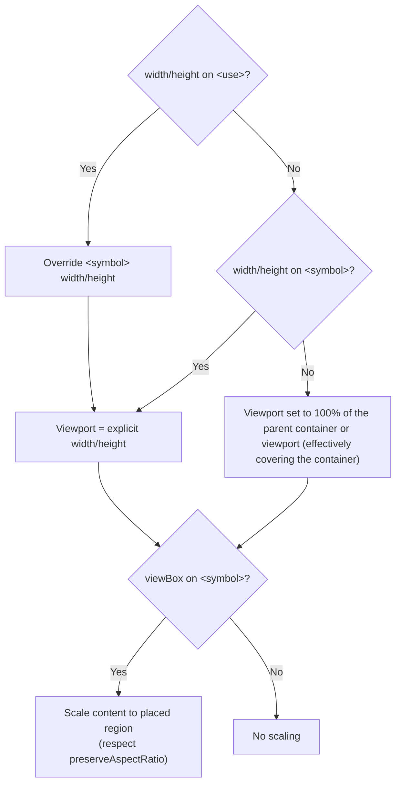

# <symbol> Usage: Coordinate System and Sizing Behavior

## Overview

The SVG [`<symbol>`](xml_symbol.html) element defines reusable graphical content that can only be rendered when instantiated by a [`<use>`](xml_use.html) element. In essence, a `<symbol>` acts like a template with its own coordinate system (similar to a nested `<svg>`), and the `<use>` element places an instance of that template into the document. This document details how `<symbol>`'s attributes (like width, height, viewBox, etc.) affect its rendering when instantiated by `<use>`, such as default sizing, coordinate system transformations, and alignment.

## Symbol Viewport and Default Bounds

A `<symbol>` element establishes an **SVG viewport** for its contents.

- If explicit `width` and `height` are not provided on the `<symbol>`, those properties are treated as "auto" and default to **100%**. In other words, the symbol has an intrinsic sizing that will fill the available space when used.
- `width` and `height` may be overridden by the `<use>`, which will replace the default behavior of "auto" if they are specified. This overridding behavior does not apply to `x` and `y` attributes, instead the `<symbol>` and `<use>` `x` and `y` coordinates are combined together.
  - So authors can set a default size on the symbol itself, but these values may be overridden by the referencing `<use>` element.
- `x`, `y`, `width`, and `height` on `<symbol>` are considered *geometry properties* just like on `<svg>`.
- If neither the symbol nor the use specifies width/height, the symbol's viewport defaults to 100% of the parent container or viewport (effectively covering the container). 

`<symbol>` elements are not rendered directly, their `width` and `height` purely define the **symbol's own viewport dimensions**. By default, the User Agent applies `overflow: hidden` to symbols, so any content outside the symbol's viewport rectangle is clipped. If a symbol has no explicit size, its viewport will auto-expand (100%) in whatever context it's placed, and overflow clipping will occur at the bounds of that region.

### No viewBox (Unitless Coordinates)

If the symbol does *not* have a `viewBox`, its coordinate system is in the same absolute units as the parent SVG. In this case, setting a `width`/`height` on the symbol (or letting it default) defines the clipping region but does not scale the content. The symbol's content is drawn at a 1:1 scale in the symbol's own coordinates.

For example:
- If either the `<symbol>` or `<use>` *does* specify its own `width`/`height` while the symbol has none (and no viewBox), the `<use>`'s dimensions define the region size, but **no scaling of the symbol's content occurs** (since scaling requires a viewBox). In such a case the content might appear cropped or only partially occupy the `<use>` area.

In summary, without a viewBox, the symbol's coordinates are interpreted directly in the parent user space, and the `<use>`'s `width`/`height` (if any) only affect the clipping region, not the content scale.

## viewBox Handling

A `<symbol>` does **not inherit any viewBox** from its outer SVG; it must define its own `viewBox` if one is needed. The symbol's coordinate system is **independent**. When a symbol is referenced via `<use>`, it behaves as if an `<svg>` with its own viewport and viewBox were embedded at that point. Therefore, any `viewBox` on the outer SVG (or parent coordinate frames) does not automatically apply to the symbol's content.

If the symbol has a `viewBox` attribute, it defines an **internal coordinate system** for the symbol's contents (min-x, min-y, width, height of the viewBox). This is analogous to how an `<svg>` element's viewBox works, establishing a mapping from the symbol's internal "user" coordinates to its viewport. The presence of a viewBox is crucial for scaling behavior: it enables the content to scale to fit the viewport set by either the symbol's or the use's width/height.

Without a viewBox, a `<use>` element's `width` and `height` don't scale the content (as noted above). 

When a symbol *does* have a viewBox, it behaves much like a mini SVG file. The viewBox defines the coordinate extents of the symbol's content and implicitly provides an aspect ratio. If the symbol's own `width` and `height` are specified, they define the viewport size into which the viewBox is scaled (by default). If the symbol's width/height are not specified (auto), and the `<use>` also doesn't specify them, then by spec the symbol's width/height default to "100%" of the context. In practice this means the symbol will stretch to fill the available area (for example, the parent SVG's viewport).

This scenario is less common in usage – typically either the symbol or the use will provide an explicit size – but it's defined for completeness.

### preserveAspectRatio on <symbol>

`<symbol>` has the `preserveAspectRatio` attribute, just like an `<svg>` element. By default (if not specified), it uses the standard `xMidYMid meet` behavior, meaning the symbol's content is uniformly scaled to *fit* the viewport while preserving aspect ratio (centering the content and possibly letterboxing if aspect ratios differ).

If `preserveAspectRatio="none"` is on the symbol, the content will be stretched *non-uniformly* to fill the viewport dimensions, which can distort the graphics.

This attribute is considered when scaling the symbol's viewBox to the viewport (whether the viewport came from the symbol's own width/height or from the `<use>`). It does not inherit from any outer context; it's a property of the symbol itself.

## Coordinate System Transformation via <use>

When a `<use>` instantiates a symbol, several coordinate system transformations occur in sequence:

1. **Symbol's Internal Coordinates:** First, the symbol's content is defined in its own coordinate space. If a `viewBox` is present on the symbol, an initial transformation maps the symbol's internal user coordinates to the symbol's viewport. This includes scaling and translating the content according to the viewBox (and applying `preserveAspectRatio` rules). At this stage, the symbol's content is fit into the symbol's viewport. If no viewBox is present, no scaling is applied – the coordinates are taken as-is.

2. **Symbol's Transform (if any):** The `<symbol>` element can have a `transform` attribute (since it's a container element). If present, this transform is applied to the symbol's content **within the symbol's viewport**. For example, `transform="scale(-1,1)"` on the symbol will flip its contents horizontally around the symbol's own origin. This happens after the viewBox mapping.

3. **Reference Point Alignment (refX/refY):** New in SVG 2, the `refX` and `refY` attributes on `<symbol>` allow shifting the content's position by defining a reference point. By default (if `refX/refY` are not specified), the **top-left corner** of the symbol's viewport is aligned to the placement point (we'll define this placement point shortly). If `refX`/`refY` are set, they specify a point in the symbol's content coordinate system (after any viewBox scaling) that should align with the placement point. For example, `refX="50%" refY="50%"` would center the symbol's content on the use's x,y location, whereas `refX="right" refY="bottom"` would align the symbol's bottom-right corner to the use's x,y. Internally, applying refX/refY is effectively a translation of the content within the symbol such that the specified reference point moves to the origin (0,0) of the symbol's viewport. (This behavior is analogous to the reference point in `<marker>` elements.) Notably, if `refX/refY` are omitted, it's **not** the same as specifying `0` – the default alignment (top-left) differs for backward-compatibility reasons.

4. **Positioning via `<use>`:** The `<use>` element has its own optional `x` and `y` attributes. These provide an *additional translation* that moves the symbol instance in the parent SVG's coordinate system. Conceptually, the `<use>` creates a copy of the symbol's content (after all symbol-internal transformations above) and then shifts it by (x, y). According to the SVG2 spec, the symbol's reference point (after applying refX/refY) will be placed exactly at the `<use>` element's (x,y) coordinates. For example, if a `<use>` has `x="100" y="50"`, the symbol's content will be positioned such that its aligned reference point appears at (100,50) in the outer SVG.

5. **Transforms on `<use>`:** The `<use>` element itself can be subject to transformations (via a `transform` attribute or applied CSS). Any such transformation will further affect the placed symbol content. The order of operations is important: in SVG2, the `x` and `y` of `<use>` are applied as a *final offset translation* **after** the `<use>`'s own `transform` property. Practically, this means if you rotate or scale a `<use>`, the rotation/scale is about the `<use>`'s origin (its un-translated position), and then the x,y translation shifts it into place. This design makes it easier to rotate/scale a symbol around its reference point without that point drifting from the specified (x,y) location. (It contrasts with ordinary elements where the transform would include any translation in its matrix.) For instance, if a `<use x="100" y="100" transform="rotate(45)">` references a symbol, the symbol will rotate in place and then the rotated content will be moved to (100,100).

**Accumulated Transformation:** The net effect of all the above is a combined transformation from the symbol's original content coordinates to the final user space of the document. The SVG2 spec describes this as the "cumulative effect" of the symbol's `x`, `y`, and its transformations, together with the host `<use>` element's transformations. Summarizing the chain:

- Symbol's viewBox transform (if any)  
- Symbol's preserveAspectRatio alignment (if applicable)  
- Symbol's own transform attribute (if any)  
- Symbol's refX/refY adjustment (if any; effectively a translation)  
- `<use>` element's transform attribute (if any)  
- `<use>` element's x,y translation offset  

All these contribute to the final positioning. Notably, **the symbol's content never inherits transforms or coordinate scaling from outside the `<use>`** – it's encapsulated. The outer SVG's coordinate system only comes into play at the moment the `<use>` places the symbol (through the `<use>`'s x, y, and transform). This encapsulation is why the symbol behaves like an independent nested SVG.
