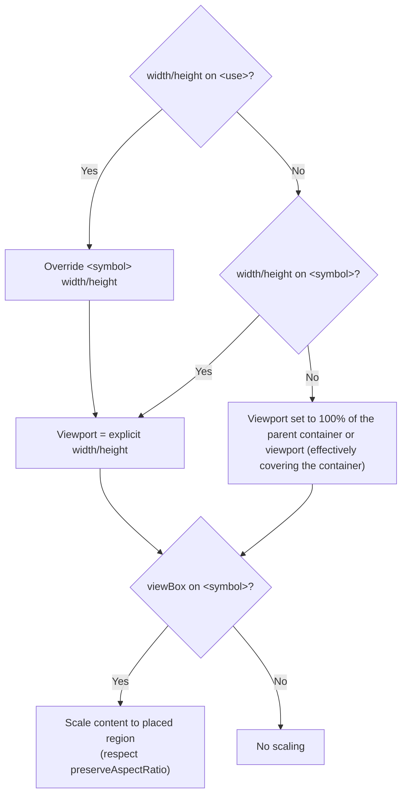

# &lt;symbol&gt; Usage: Coordinate System and Sizing Behavior {#SymbolElementUsage}

## Overview

The SVG [`<symbol>`](xml_symbol.html) element defines reusable graphical content that is rendered only when a [`<use>`](xml_use.html) element instantiates it. A `<symbol>` acts like a template with its own coordinate system (similar to a nested `<svg>`), and the `<use>` element places an instance of that template into the document. This page covers how the `<symbol>` attributes (`width`, `height`, `viewBox`, and the rest) affect rendering when a `<use>` instantiates the symbol: default sizing, coordinate system transformations, and alignment.

## Symbol Viewport and Default Bounds

A `<symbol>` element establishes an **SVG viewport** for its contents.

- If explicit `width` and `height` are not provided on the `<symbol>`, those properties are treated as "auto" and default to **100%**. The symbol then has an intrinsic size that fills the available space when used.
- `width` and `height` may be overridden by the `<use>`, which replaces the "auto" default when they are specified. This overriding does not apply to the `x` and `y` attributes; the `<symbol>` and `<use>` `x` and `y` coordinates are added together instead.
  - Authors can set a default size on the symbol itself, and the referencing `<use>` element may override it.
- `x`, `y`, `width`, and `height` on `<symbol>` are *geometry properties*, as they are on `<svg>`.
- If neither the symbol nor the use specifies width/height, the symbol's viewport defaults to 100% of the parent container or viewport, covering the container.

`<symbol>` elements are not rendered directly; their `width` and `height` define only the **symbol's own viewport dimensions**. By default, the user agent applies `overflow: hidden` to symbols, so content outside the symbol's viewport rectangle is clipped. If a symbol has no explicit size, its viewport expands to 100% in whatever context it is placed, and overflow clipping occurs at the bounds of that region.

\htmlonly
<svg id="symbol_usage_sizing" width="360" height="180" viewBox="0 0 360 180" style="background-color: white" font-family="sans-serif" font-size="11">
  <defs>
    <symbol id="symbol_usage_sizing_noSize" viewBox="0 0 100 100">
      <circle cx="50" cy="50" r="40" fill="#4a90e2" stroke="#1f5a8a" stroke-width="3" />
    </symbol>
    <symbol id="symbol_usage_sizing_withSize" viewBox="0 0 100 100" width="60" height="60">
      <circle cx="50" cy="50" r="40" fill="#e27a4a" stroke="#8a411f" stroke-width="3" />
    </symbol>
  </defs>
  <rect x="20"  y="30" width="120" height="120" fill="none" stroke="#bbb" stroke-dasharray="3,3" />
  <use href="#symbol_usage_sizing_noSize" x="20" y="30" width="120" height="120" />
  <text x="80" y="165" text-anchor="middle">Symbol with no width/height →</text>
  <text x="80" y="20" text-anchor="middle">stretches to &lt;use&gt; box</text>
  <rect x="200" y="30" width="120" height="120" fill="none" stroke="#bbb" stroke-dasharray="3,3" />
  <use href="#symbol_usage_sizing_withSize" x="200" y="30" width="120" height="120" />
  <text x="260" y="165" text-anchor="middle">Symbol with explicit 60×60 →</text>
  <text x="260" y="20" text-anchor="middle">keeps its authored size</text>
</svg>
\endhtmlonly

### No viewBox (Unitless Coordinates)

If the symbol does *not* have a `viewBox`, its coordinate system uses the same absolute units as the parent SVG. Setting a `width`/`height` on the symbol, or letting it default, defines the clipping region but does not scale the content. The symbol's content is drawn at 1:1 scale in the symbol's own coordinates.

For example:
- If either the `<symbol>` or `<use>` *does* specify its own `width`/`height` while the symbol has none (and no viewBox), the `<use>`'s dimensions define the region size, but **no scaling of the symbol's content occurs**, because scaling requires a viewBox. The content may then appear cropped, or occupy only part of the `<use>` area.

Without a viewBox, the symbol's coordinates are interpreted directly in the parent user space, and the `<use>`'s `width`/`height` (if any) affect the clipping region, not the content scale.

```mermaid
flowchart TD
    question_wh_on_use{"`width/height on &lt;use&gt;?`"}
    override_wh["Override &lt;symbol&gt; width/height"]
    question_wh_on_symbol{"width/height on &lt;symbol&gt;?"}
    sizes_to_viewport["Viewport set to 100% of the parent container or viewport (effectively covering the container)"]
    viewport_explicit["Viewport = explicit width/height"]

    question_viewBox{"viewBox on &lt;symbol&gt;?"}
    viewport_scale["Scale content to placed region<br/>(respect preserveAspectRatio)"]
    viewport_no_scale["No scaling"]

    %% Flow
    question_wh_on_use -- Yes --> override_wh
    question_wh_on_use -- No  --> question_wh_on_symbol

    override_wh --> viewport_explicit

    question_wh_on_symbol -- Yes --> viewport_explicit
    question_wh_on_symbol -- No  --> sizes_to_viewport

    viewport_explicit --> question_viewBox
    sizes_to_viewport --> question_viewBox
    
    question_viewBox -- Yes --> viewport_scale
    question_viewBox -- No  --> viewport_no_scale
```

## viewBox Handling

A `<symbol>` does **not inherit any viewBox** from its outer SVG; it must define its own `viewBox` if one is needed. The symbol's coordinate system is **independent**. When a `<use>` references a symbol, the symbol behaves as if an `<svg>` with its own viewport and viewBox were embedded at that point, so a `viewBox` on the outer SVG or on a parent coordinate frame does not apply to the symbol's content.

If the symbol has a `viewBox` attribute, it defines an **internal coordinate system** for the symbol's contents (min-x, min-y, width, height of the viewBox). This works the same way as an `<svg>` element's viewBox, establishing a mapping from the symbol's internal "user" coordinates to its viewport. The viewBox enables scaling: it scales the content to fit the viewport set by either the symbol's or the use's width/height.

Without a viewBox, a `<use>` element's `width` and `height` do not scale the content, as noted above.

When a symbol *does* have a viewBox, it behaves much like a mini SVG file. The viewBox defines the coordinate extents of the symbol's content and implicitly provides an aspect ratio. If the symbol's own `width` and `height` are specified, they define the viewport size into which the viewBox is scaled (by default). If the symbol's width/height are not specified (auto), and the `<use>` does not specify them either, the spec defaults the symbol's width/height to "100%" of the context, so the symbol stretches to fill the available area (for example, the parent SVG's viewport).

This scenario is uncommon, since typically either the symbol or the use provides an explicit size, but the behavior is defined for completeness.

\htmlonly
<svg id="symbol_usage_viewBox" width="360" height="180" viewBox="0 0 360 180" style="background-color: white" font-family="sans-serif" font-size="11">
  <defs>
    <symbol id="symbol_usage_viewBox_star" viewBox="0 0 100 100">
      <polygon points="50,5 62,40 98,40 68,62 78,95 50,75 22,95 32,62 2,40 38,40" fill="#e0a63a" stroke="#7a5a1a" stroke-width="3" />
    </symbol>
  </defs>
  <text x="180" y="15" text-anchor="middle" font-weight="bold">Same symbol at 3 different &lt;use&gt; sizes</text>
  <rect x="20"  y="30" width="40" height="40" fill="none" stroke="#bbb" stroke-dasharray="3,3" />
  <use href="#symbol_usage_viewBox_star" x="20" y="30" width="40" height="40" />
  <text x="40" y="90" text-anchor="middle">40×40</text>
  <rect x="100" y="30" width="80" height="80" fill="none" stroke="#bbb" stroke-dasharray="3,3" />
  <use href="#symbol_usage_viewBox_star" x="100" y="30" width="80" height="80" />
  <text x="140" y="130" text-anchor="middle">80×80</text>
  <rect x="220" y="30" width="120" height="120" fill="none" stroke="#bbb" stroke-dasharray="3,3" />
  <use href="#symbol_usage_viewBox_star" x="220" y="30" width="120" height="120" />
  <text x="280" y="170" text-anchor="middle">120×120</text>
</svg>
\endhtmlonly

### preserveAspectRatio on `<symbol>`

\htmlonly
<svg id="symbol_usage_par" width="400" height="180" viewBox="0 0 400 180" style="background-color: white" font-family="sans-serif" font-size="11">
  <defs>
    <symbol id="symbol_usage_par_star" viewBox="0 0 100 100" preserveAspectRatio="xMidYMid meet">
      <rect x="0" y="0" width="100" height="100" fill="#e0a63a" opacity="0.3" />
      <polygon points="50,5 62,40 98,40 68,62 78,95 50,75 22,95 32,62 2,40 38,40" fill="#e0a63a" stroke="#7a5a1a" stroke-width="3" />
    </symbol>
    <symbol id="symbol_usage_par_slice" viewBox="0 0 100 100" preserveAspectRatio="xMidYMid slice">
      <rect x="0" y="0" width="100" height="100" fill="#e0a63a" opacity="0.3" />
      <polygon points="50,5 62,40 98,40 68,62 78,95 50,75 22,95 32,62 2,40 38,40" fill="#e0a63a" stroke="#7a5a1a" stroke-width="3" />
    </symbol>
    <symbol id="symbol_usage_par_none" viewBox="0 0 100 100" preserveAspectRatio="none">
      <rect x="0" y="0" width="100" height="100" fill="#e0a63a" opacity="0.3" />
      <polygon points="50,5 62,40 98,40 68,62 78,95 50,75 22,95 32,62 2,40 38,40" fill="#e0a63a" stroke="#7a5a1a" stroke-width="3" />
    </symbol>
  </defs>
  <text x="200" y="15" text-anchor="middle" font-weight="bold">Wide 2:1 &lt;use&gt; box with each preserveAspectRatio mode</text>
  <rect x="10"  y="30" width="120" height="60" fill="none" stroke="#bbb" stroke-dasharray="3,3" />
  <use href="#symbol_usage_par_star"  x="10"  y="30" width="120" height="60" />
  <text x="70"  y="105" text-anchor="middle" font-family="monospace">xMidYMid meet</text>
  <text x="70"  y="120" text-anchor="middle">(letterbox)</text>
  <rect x="145" y="30" width="120" height="60" fill="none" stroke="#bbb" stroke-dasharray="3,3" />
  <use href="#symbol_usage_par_slice" x="145" y="30" width="120" height="60" clip-path="inset(0)" />
  <text x="205" y="105" text-anchor="middle" font-family="monospace">xMidYMid slice</text>
  <text x="205" y="120" text-anchor="middle">(crop)</text>
  <rect x="280" y="30" width="120" height="60" fill="none" stroke="#bbb" stroke-dasharray="3,3" />
  <use href="#symbol_usage_par_none"  x="280" y="30" width="120" height="60" />
  <text x="340" y="105" text-anchor="middle" font-family="monospace">none</text>
  <text x="340" y="120" text-anchor="middle">(stretch)</text>
</svg>
\endhtmlonly

`<symbol>` has the `preserveAspectRatio` attribute, as an `<svg>` element does. When it is not specified, the default is `xMidYMid meet`: the symbol's content is uniformly scaled to *fit* the viewport while preserving aspect ratio, centering the content and letterboxing it if the aspect ratios differ.

With `preserveAspectRatio="none"` on the symbol, the content is stretched *non-uniformly* to fill the viewport dimensions, which can distort the graphics.

This attribute applies when scaling the symbol's viewBox to the viewport, whether that viewport came from the symbol's own width/height or from the `<use>`. It does not inherit from any outer context; it is a property of the symbol itself.

## Coordinate System Transformation via `<use>`

When a `<use>` instantiates a symbol, several coordinate system transformations happen in sequence:

1. **Symbol's Internal Coordinates:** First, the symbol's content is defined in its own coordinate space. If a `viewBox` is present on the symbol, an initial transformation maps the symbol's internal user coordinates to the symbol's viewport. This includes scaling and translating the content according to the viewBox (and applying `preserveAspectRatio` rules). At this stage, the symbol's content is fit into the symbol's viewport. If no viewBox is present, no scaling is applied and the coordinates are taken as-is.

2. **Symbol's Transform (if any):** The `<symbol>` element can have a `transform` attribute, because it is a container element. If present, this transform is applied to the symbol's content **within the symbol's viewport**. For example, `transform="scale(-1,1)"` on the symbol flips its contents horizontally around the symbol's own origin. This happens after the viewBox mapping.

3. **Reference Point Alignment (refX/refY):** New in SVG 2, the `refX` and `refY` attributes on `<symbol>` shift the content's position by defining a reference point. When `refX/refY` are not specified, the **top-left corner** of the symbol's viewport is aligned to the placement point, which is defined in step 4 below. If `refX`/`refY` are set, they specify a point in the symbol's content coordinate system (after any viewBox scaling) that aligns with the placement point. For example, `refX="50%" refY="50%"` centers the symbol's content on the use's x,y location, whereas `refX="right" refY="bottom"` aligns the symbol's bottom-right corner to the use's x,y. Internally, applying refX/refY is a translation of the content within the symbol so that the specified reference point moves to the origin (0,0) of the symbol's viewport. (This is analogous to the reference point in `<marker>` elements.) Omitting `refX/refY` is **not** the same as specifying `0`; the default alignment (top-left) differs for backward-compatibility reasons.

\htmlonly
<svg id="symbol_usage_ref" width="400" height="180" viewBox="0 0 400 180" style="background-color: white" font-family="sans-serif" font-size="11">
  <defs>
    <symbol id="symbol_usage_ref_default" viewBox="0 0 100 100" width="80" height="80">
      <circle cx="50" cy="50" r="45" fill="#4a90e2" fill-opacity="0.6" stroke="#1f5a8a" stroke-width="2" />
    </symbol>
    <symbol id="symbol_usage_ref_center" viewBox="0 0 100 100" width="80" height="80" refX="50" refY="50">
      <circle cx="50" cy="50" r="45" fill="#e27a4a" fill-opacity="0.6" stroke="#8a411f" stroke-width="2" />
    </symbol>
  </defs>
  <text x="200" y="15" text-anchor="middle" font-weight="bold">The same &lt;use x="100" y="90"/&gt; with different refX/refY</text>
  <line x1="100" y1="30"  x2="100" y2="160" stroke="#c33" stroke-dasharray="3,3" />
  <line x1="20"  y1="90"  x2="180" y2="90"  stroke="#c33" stroke-dasharray="3,3" />
  <use href="#symbol_usage_ref_default" x="100" y="90" />
  <circle cx="100" cy="90" r="3" fill="#c33" />
  <text x="100" y="175" text-anchor="middle">default (top-left at x,y)</text>
  <line x1="300" y1="30"  x2="300" y2="160" stroke="#c33" stroke-dasharray="3,3" />
  <line x1="220" y1="90"  x2="380" y2="90"  stroke="#c33" stroke-dasharray="3,3" />
  <use href="#symbol_usage_ref_center" x="300" y="90" />
  <circle cx="300" cy="90" r="3" fill="#c33" />
  <text x="300" y="175" text-anchor="middle">refX=50 refY=50 (centered at x,y)</text>
</svg>
\endhtmlonly

4. **Positioning via `<use>`:** The `<use>` element has its own optional `x` and `y` attributes. These provide an *additional translation* that moves the symbol instance in the parent SVG's coordinate system. The `<use>` creates a copy of the symbol's content, after all the symbol-internal transformations above, and then shifts it by (x, y). Per the SVG 2 spec, the symbol's reference point (after applying refX/refY) is placed exactly at the `<use>` element's (x,y) coordinates. For example, if a `<use>` has `x="100" y="50"`, the symbol's content is positioned so that its aligned reference point appears at (100,50) in the outer SVG.

5. **Transforms on `<use>`:** The `<use>` element itself can be subject to transformations, through a `transform` attribute or applied CSS. Any such transformation further affects the placed symbol content. The order of operations matters: in SVG 2, the `x` and `y` of `<use>` are applied as a *final offset translation* **after** the `<use>`'s own `transform` property. Rotating or scaling a `<use>` therefore rotates or scales about the `<use>`'s origin (its un-translated position), and the x,y translation then shifts the result into place. This makes it possible to rotate or scale a symbol around its reference point without that point drifting from the specified (x,y) location. It contrasts with ordinary elements, where the transform would include any translation in its matrix. For instance, if a `<use x="100" y="100" transform="rotate(45)">` references a symbol, the symbol rotates in place and the rotated content is then moved to (100,100).

**Accumulated Transformation:** The net effect of all the above is a combined transformation from the symbol's original content coordinates to the final user space of the document. The SVG 2 spec describes this as the "cumulative effect" of the symbol's `x`, `y`, and its transformations, together with the host `<use>` element's transformations. The chain is:

- Symbol's viewBox transform (if any)  
- Symbol's preserveAspectRatio alignment (if applicable)  
- Symbol's own transform attribute (if any)  
- Symbol's refX/refY adjustment (if any; effectively a translation)  
- `<use>` element's transform attribute (if any)  
- `<use>` element's x,y translation offset  

All of these contribute to the final positioning. **The symbol's content never inherits transforms or coordinate scaling from outside the `<use>`**; it is encapsulated. The outer SVG's coordinate system comes into play only when the `<use>` places the symbol, through the `<use>`'s x, y, and transform. That encapsulation is why the symbol behaves like an independent nested SVG.
